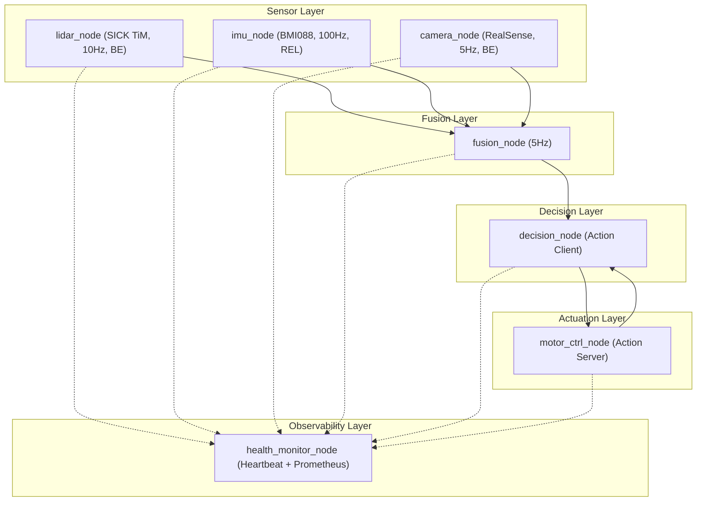
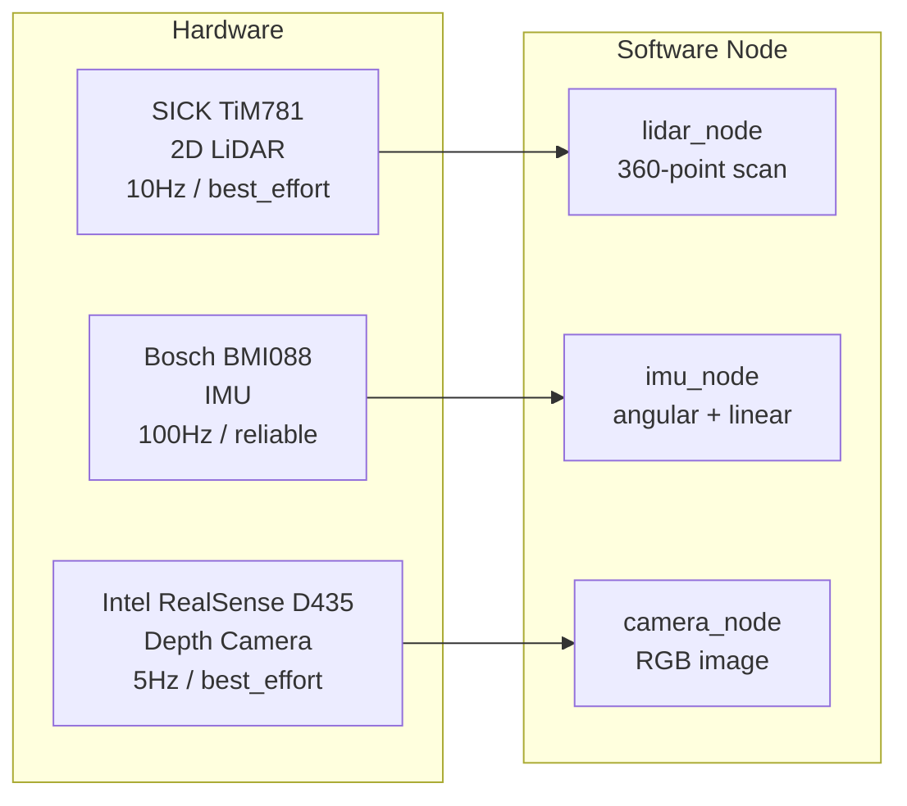
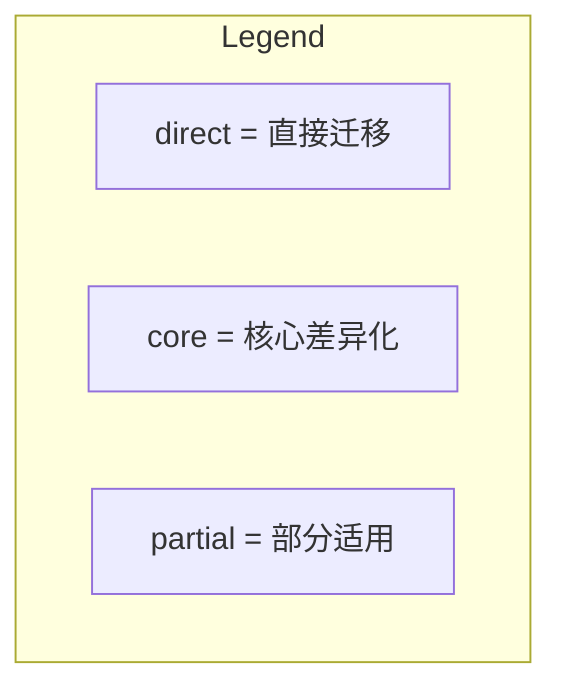

# PRD — ros2_robot_middleware

## 1. 项目元信息

| 属性 | 值 |
|------|-----|
| 项目名 | ros2_robot_middleware |
| 版本 | 1.0.0 |
| 负责人 | guang |
| 电梯演讲 | 面向仓储 AMR 场景的 ROS2 中间件，覆盖感知-融合-决策-执行全链路。支持一键部署，内置 CI/CD、限流日志、结构化日志，开箱可验证 |

## 2. Learning Objectives

**Goal:** Build production-grade ROS2 middleware expertise through hands-on implementation, covering lifecycle management, fault tolerance, QoS tuning, multi-robot coordination, and security.

## 3. 产品定位

**三个关键词：**

| 定位 | 一句话解释 |
|------|-----------|
| **协议级定制** | 不止调 rclcpp API，能深入 Fast-DDS 层做 QoS Profiling、RTPS 调优、序列化定制 |
| **系统全栈** | 从传感器到执行器的完整数据链路，覆盖 Topic / Service / Action 三种通信范式 |
| **可交付** | 一键部署、CI 绿钩、gtest 覆盖、限流日志，代码可以直接进生产分支 |

**护城河：** 在 "会用 ROS2" 和 "能改 DDS" 之间，大部分候选人停在第一层。本项目证明你到了第二层。

## 4. 业务场景

**一句话：** 仓储 AMR 在执行搬运任务时，通过激光雷达、IMU、摄像头实时感知周围环境，融合多传感器数据识别障碍物，决策路径，控制电机执行避障和导航。

**架构总览：**

**节点与硬件对标：**

**QoS 选型理由：**

| 传感器 | QoS | 原因 |
|--------|-----|------|
| LiDAR | best_effort | 10Hz 偶尔丢一帧不影响 SLAM，reliable 重传积累延迟反而危险 |
| IMU | reliable | 控制闭环每帧都关键，丢一帧控制器缺少当前姿态估计，AMR 跑偏 |
| Camera | best_effort | 30fps 视觉跟踪允许偶尔丢帧，带宽有限，重传会阻塞管道 |

## 5. 功能需求 (Must Have)

| 编号 | 需求 | 验收标准 |
|------|------|----------|
| R0 | DDS 深度定制 | ① Fast-DDS XML Profile 文件自定义 DDS 底层行为；② 测试输出含 best_effort vs reliable 延迟/丢包量化对比数据 |
| R1 | 7 节点感知-决策-执行-监控流水线 | launch 一键启动，各节点独立运行 |
| R2 | 混合 QoS，有量化对比 | 测试用例对比 best_effort vs reliable 的延迟/丢包 |
| R3 | 自定义消息/服务/动作 | 类型安全，非 String 透传 |
| R4 | 一键环境搭建 | `./scripts/setup_deps.sh` 幂等安装所有依赖 |
| R5 | 一键编译 + 测试 | `./test/test.sh` 编译 + 运行 All Green |
| R6 | 运行时参数调优 | `ros2 param set` 不重启生效 |
| R7 | 结构化限流日志 | 无日志风暴，日志可 grep/可视化 |
| R8 | CI 自动触发 | 每次 push 绿钩 |
| R9 | Docker 部署 | `docker-compose up` 启动全部节点 |
| R10 | Design Doc | 架构图、trade-off 记录、开源对比分析 |
| R11 | 健康监控 + Prometheus 指标 | heartbeat 心跳监控 6 节点 OK/WARN/ERROR/STALE 状态，`:9090/metrics` 提供 Prometheus gauge 指标 |

## 6. 非功能需求 (Won't Have)

| 编号 | 不做的事项 | 原因 |
|------|-----------|------|
| ~R11~ | 硬件接入 | 纯软件模拟，不依赖真实传感器 |
| ~R12~ | 真实导航算法 | 路径规划用简单模拟，核心展示中间件能力 |

## 7. 能力迁移矩阵

| 能力 | AMR | 自动驾驶 | 无人机 | 工业机器人 | 医疗机器人 | 人形机器人 |
|------|-----|---------|--------|-----------|-----------|-----------|
| ROS2 应用开发 | direct | direct | direct | direct | direct | direct |
| DDS/Fast-DDS 定制 | direct | direct | direct | partial | direct | direct |
| 混合 QoS 设计 | direct | direct | direct | direct | direct | direct |
| 传感器数据管道 | direct | direct | direct | direct | direct | direct |
| Action/Service 通信 | direct | direct | direct | direct | direct | direct |
| 分布式节点拓扑 | direct | direct | partial | direct | direct | direct |
| 实时约束设计 | direct | core | direct | direct | core | direct |
| Docker/CI/工程化 | direct | direct | direct | direct | direct | direct |

## 8. 参考资料

### a) 对标开源项目

| 项目 | 对标点 | 我们的差异化 |
|------|--------|------------|
| [nav2](https://github.com/ros-navigation/navigation2) | 感知-规划-控制流水线，头部厂商支持，商业化成熟 | nav2 是算法框架，我们是中间件定制，不同层 |
| [ros2_control](https://github.com/ros-controls/ros2_control) | Action Server / 电机控制硬件抽象 | ros2_control 专注硬件抽象层，我们展示端到端 DDS 通信链路 |

### b) 行业标准

| 标准 | 与项目关系 |
|------|-----------|
| Adaptive AUTOSAR | 车载 DDS 通信标准，泛机器人领域也在参考 |
| OMG DDS 1.4 规范 | Fast-DDS 协议基础，RTPS 发现与序列化能力 |

### c) ROS2 官方文档

| 能力 | 链接 |
|------|------|
| 总入口 | [docs.ros.org/en/jazzy](https://docs.ros.org/en/jazzy/) |
| QoS 配置 | [About Quality of Service Settings](https://docs.ros.org/en/jazzy/Concepts/About-Quality-of-Service-Settings.html) |
| Action 创建 | [Writing an Action Server/Client (C++)](https://docs.ros.org/en/jazzy/Tutorials/Intermediate/Writing-an-Action-Server-Client/Cpp.html) |
| 参数回调 | [Using Parameters in a Class (C++)](https://docs.ros.org/en/jazzy/Tutorials/Intermediate/Using-Parameters-In-A-Class-CPP.html) |
