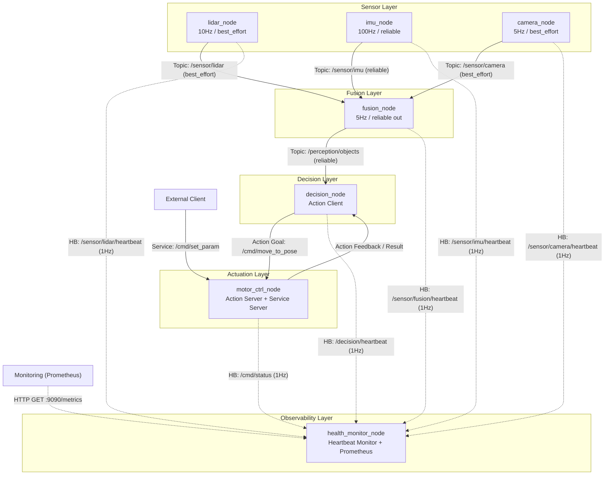

# Design Doc — ros2_robot_middleware

## 1. 节点拓扑与通信模式



**通信模式选型理由：**

| 链路 | 模式 | 理由 |
|------|------|------|
| Sensor → Fusion | Topic (单向) | 传感器是纯数据生产者，不关心消费方。单向流，Publisher/Subscriber 解耦 |
| Fusion → Decision | Topic (单向) | 感知结果是持续数据流（5Hz），Action 的 Goal-Feedback-Result 三阶段握手对持续流太重 |
| Decision → Motor | Action (双向) | 移动到目标点是长耗时操作（秒级），需要实时反馈进度、支持取消、确认到达 |
| External → Motor | Service (请求-响应) | 设一个参数是一次性的、毫秒级完成，不需要状态跟踪 |
| All Nodes → HealthMonitor | Topic (心跳, 单向) | 每个节点 1Hz 发布 `std_msgs/String` 到专用 topic，health_monitor 订阅全部 6 路，按超时判定 OK/WARN/ERROR/STALE |
| Prometheus → HealthMonitor | HTTP (拉模式) | health_monitor 内嵌 TCP 服务器监听 `:9090`，解析 `GET /metrics` 返回 Prometheus text 格式的 gauge 指标 |

## 2. 分层架构

```mermaid
flowchart TB
    subgraph Interface["Interface Layer (IDL)"]
        direction LR
        M1["LidarScan.msg"]
        M2["ImuData.msg"]
        M3["CameraImage.msg"]
        M4["PerceptionObjects.msg"]
        M5["HealthStatus.msg"]
        M6["HealthReport.msg"]
        S1["SetParam.srv"]
        A1["MoveToPose.action"]
    end

    subgraph App["Application Layer (6 Nodes)"]
        direction LR
        N1["lidar_node"]
        N2["imu_node"]
        N3["camera_node"]
        N4["fusion_node"]
        N5["decision_node"]
        N6["motor_ctrl_node"]
        N7["health_monitor_node"]
    end

    subgraph Logic["Business Logic"]
        direction LR
        BL1["Sensor Simulation"]
        BL2["Data Fusion + Detection"]
        BL3["Goal Dispatch"]
        BL4["Trajectory Execution"]
    end

    subgraph ROS2["ROS2 Middleware"]
        direction LR
        R1["rclcpp Publisher/Subscriber"]
        R2["rclcpp_action Client/Server"]
        R3["rclcpp Service Server"]
        R4["Parameter Callback"]
    end

    subgraph DDS["DDS Transport (Fast-DDS)"]
        D1["RTPS Discovery"]
        D2["QoS Matching"]
        D3["CDR Serialization"]
    end

    Interface --> App
    App --> Logic
    Logic --> ROS2
    ROS2 --> DDS
```



**各层职责与接口约束：**

| 层 | 职责 | 允许依赖 | 禁止依赖 |
|----|------|---------|---------|
| Interface | 定义数据类型与通信契约 | std_msgs/Header | 不依赖任何节点实现 |
| Application | 节点生命周期、通信通道创建 | Interface 层的生成代码 | 节点间不直接 include 对方的类 |
| Business Logic | 传感器模拟算法、融合逻辑、运动控制 | Application 层传入的数据对象 | 不直接调用 rclcpp API（通过 Application 层封装的回调） |
| ROS2 Middleware | 提供发布/订阅/动作/服务 API | rclcpp, rclcpp_action | 不包含业务逻辑 |
| DDS Transport | RTPS 协议发现、QoS 匹配、序列化 | Fast-DDS, OMG DDS 规范 | 不感知 ROS2 节点概念 |

## 3. 技术选型

| 选项 | 实际选型 | 替代方案 | 选型理由 |
|------|---------|---------|----------|
| **构建系统** | colcon + ament_cmake | CMake 原生、Bazel | colcon 是 ROS2 官方标准；ament_cmake 提供 rosidl 代码生成；Bazel 多语言支持更好但 ROS2 生态支持不成熟 |
| **RMW 实现** | Fast-DDS (eProsima) | Cyclone DDS、RTI Connext | ROS2 Jazzy 默认；Apache-2.0 许可证无商用限制；XML Profile 可定制底层行为（R0 核心需求） |
| **C++ 标准** | C++17 | C++20 | Ubuntu 24.04 默认工具链完整支持；rclcpp API 使用 C++17（非 C++20）；稳定性和兼容性优先 |
| **通信范式** | Topic + Service + Action | 纯 Topic | 不同场景匹配不同范式：持续流用 Topic（传感器），短调用用 Service（参数），长操作用 Action（运动） |
| **测试框架** | gtest + 独立 CMake 工程 | ament_cmake_gtest | 独立工程零生产代码侵入；通过 Publisher/Service Client 驱动测试（集成测试优先级高于单元测试） |
| **日志** | RCLCPP_*_THROTTLE | spdlog、glog | ROS2 内置，无需额外依赖；限流宏防止高频日志风暴 |

## 4. DDS 定制计划 (R0)

### 4.1 Fast-DDS XML Profile 自定义配置

```xml
<!-- 示例：自定义 Discovery 和 Socket Buffer -->
<profiles>
    <participant profile_name="robot_participant">
        <rtps>
            <builtin>
                <initialAnnouncements>
                    <count>5</count>      <!-- 启动时多发几次 Announcement，加速发现 -->
                </initialAnnouncements>
            </builtin>
        </rtps>
    </participant>
    <data_writer profile_name="imu_writer">
        <qos>
            <reliability>
                <kind>RELIABLE</kind>
            </reliability>
        </qos>
        <historyMemoryPolicy>PREALLOCATED</historyMemoryPolicy>
    </data_writer>
    <data_reader profile_name="lidar_reader">
        <qos>
            <reliability>
                <kind>BEST_EFFORT</kind>
            </reliability>
        </qos>
    </data_reader>
</profiles>
```

**计划修改的 DDS 参数：**

| 参数 | 默认值 | 自定义值 | 目的 |
|------|--------|---------|------|
| `initialAnnouncements.count` | 3 | 5 | 加速节点启动时的 RTPS 发现，减少冷启动丢消息 |
| `historyMemoryPolicy` | DYNAMIC | PREALLOCATED (IMU writer) | 预分配内存，避免动态扩容引入的延迟抖动，适合高频 reliable 通道 |
| `socketBufferSize` | 默认 | 待量化测试后确定 | 防止 best_effort 通道在高负载下丢帧 |

### 4.2 QoS 量化对比实验

**实验设计：**

| 变量 | 对照组 (best_effort) | 实验组 (reliable) |
|------|---------------------|-------------------|
| 发布频率 | 10Hz / 100Hz / 200Hz | 同左 |
| 网络条件 | 本地 localhost | 同左 |
| 丢包统计 | 订阅端计数 missing seq | 同左 |
| 延迟测量 | 消息时间戳 vs 订阅收到时间 | 同左 |

**测试用例输出格式（预期）：**

```
[QoS Benchmark] sensor=lidar qos=best_effort rate=200Hz
  sent=2000, received=1987, loss=0.65%, avg_latency=0.8ms, p99_latency=2.1ms

[QoS Benchmark] sensor=lidar qos=reliable rate=200Hz
  sent=2000, received=2000, loss=0.00%, avg_latency=1.5ms, p99_latency=4.3ms
```

**面试时的一句话解释：**

> "best_effort 延迟低（0.8ms）但丢 0.65%；reliable 零丢包但延迟翻倍（1.5ms）。选择哪个取决于传感器：IMU 不能丢所以用 reliable，LiDAR 可以忍受偶尔丢帧所以用 best_effort。这个 trade-off 不是在 rclcpp 层背下来的，是我实际测出来的。"

## 5. 逐节点业务逻辑

### 5.1 lidar_node — 激光雷达传感器模拟

**职责：** 模拟 SICK TiM781 2D LiDAR，10Hz 发布距离+反射率数据。

**输入：** 无（自主定时器驱动）

**输出：** `Topic: /sensor/lidar` → `LidarScan`，QoS = `best_effort(10)`

**模拟算法：**
```
每 100ms:
  header.stamp = now(), frame_id = "lidar_frame"
  angle_min = -π, angle_max = π, angle_increment = 2π/360
  for i in 0..359:
    ranges[i]     = 5.0 + 1.5 * sin(angle*3) * cos(angle*2)  // 模拟非对称房间墙壁轮廓
    intensities[i] = 1.0 - ranges[i]/10.0                       // 反射强度与距离成反比
  publish
```

### 5.2 imu_node — 惯性测量单元传感器模拟

**职责：** 模拟 Bosch BMI088 IMU，100Hz 发布角速度+加速度。

**输入：** 无（自主定时器驱动）

**输出：** `Topic: /sensor/imu` → `ImuData`，QoS = `reliable(10)`

**模拟算法：**
```
每 10ms:
  header.stamp = now(), frame_id = "imu_link"
  angular_velocity[3]     = ±0.02 rad/s 随机噪声  // 静止机器人陀螺仪漂移
  linear_acceleration[3]  = ±0.1 m/s² 随机噪声   // 加速度计本底噪声
  publish
```

### 5.3 camera_node — RGB 相机传感器模拟

**职责：** 模拟 Intel RealSense D435，5Hz 发布 640×480 RGB 图像。

**输入：** 无（自主定时器驱动）

**输出：** `Topic: /sensor/camera` → `CameraImage`，QoS = `best_effort(10)`

**模拟算法：**
```
每 200ms:
  header.stamp = now(), frame_id = "camera_link"
  height = 480, width = 640, encoding = "rgb8"
  step   = 640 * 3 = 1920          // 每行字节数，无 padding
  data.resize(480 * 640 * 3)       // 921,600 字节
  for byte in data: byte = rand() % 256
  publish
```

### 5.4 fusion_node — 多传感器融合

**职责：** 订阅 3 路传感器数据，缓存最新帧，5Hz 从 lidar 数据提取物体。

**输入：** `/sensor/lidar` (best_effort), `/sensor/imu` (reliable), `/sensor/camera` (best_effort)

**输出：** `Topic: /perception/objects` → `PerceptionObjects`，QoS = `reliable(10)`

**融合策略：**
```
订阅回调 (每个传感器):
  *_cache_ = 最新消息  // 覆盖式更新，只保留最新一帧

定时器回调 (5Hz):
  if lidar_cache_ 为空 or imu_cache_ 为空 or camera_cache_ 为空:
    return  // 任意传感器未就绪则跳过

  objects = []
  扫描 360 个 lidar ranges:
    if range ∈ (0.1, 3.0)  // 距离 < 3m 视为"命中"
      连续命中 > 5 个角度 bin → 聚类为一个物体
      取聚类中点角度 + 距离 → 极坐标转笛卡尔坐标 (x, y)
      objects.append(Object{id="obj_N", x, y, z=0})
      if len(objects) >= 5: break  // 至多 5 个

  header.frame_id = "base_link"
  publish PerceptionObjects{header, objects}
```

### 5.5 decision_node — 决策层 Action Client

**职责：** 订阅感知结果，取最近物体坐标作为目标，通过 Action Client 发给 motor_ctrl。

**输入：** `Topic: /perception/objects` → `PerceptionObjects`

**输出：** `Action Goal: /cmd/move_to_pose` → `MoveToPose.Goal{x, y, theta}`

**决策逻辑：**
```
订阅回调:
  if objects 非空:
    取 objects[0] 坐标作为目标  // 取最近物体
    goal = MoveToPose.Goal{x = obj.x, y = obj.y, theta = 0}
    action_client->async_send_goal(goal)

结果回调:
  收到 action result → RCLCPP_INFO 输出到达确认
```

### 5.6 motor_ctrl_node — 执行层 Action Server

**职责：** 接收 MoveToPose 目标，直线插值模拟运动，10Hz 发布 feedback；暴露 SetParam Service。

**输入：** `Action Goal: /cmd/move_to_pose`（接收），`Service: /cmd/set_param`（接收）

**输出：** `Action Feedback/Result: /cmd/move_to_pose`（回复）

**运动控制算法：**
```
收到 Goal(x_target, y_target):
  当前坐标 = (0, 0)
  while 距离(当前, 目标) > 阈值:
    当前 += 步长 * (目标 - 当前) / 距离  // 直线插值，每 100ms 推进
    publish Feedback{current_x, current_y}
  publish Result{reached = true}

收到 SetParam Service:
  更新内部参数（如速度、加速度限制）
  返回 success = true
```

### 5.7 health_monitor_node — 健康监控 + Prometheus 指标

**职责：** 通过心跳机制监控全部 6 个业务节点存活状态，周期性发布健康报告，提供 Prometheus 指标拉取端点。

**输入：** 6 路心跳 topic（`std_msgs::msg::String`），`Service: /health/check`（接收）

**输出：** `Topic: /health/report` → `HealthReport`，`HTTP :9090/metrics`（Prometheus pull）

**健康判定逻辑：**
```
每 check_interval_s_ (默认 1s):
  for each registered node (lidar, imu, camera, fusion, decision, motor_ctrl):
    elapsed = now - last_seen[node]
    if last_seen 不存在:
      status = STALE
    elif elapsed > timeout_s:
      status = ERROR
    elif elapsed > timeout_s * 0.8:
      status = WARN
    else:
      status = OK
  publish HealthReport{header, nodes[]}  // 6 个 HealthStatus 打包
```

**Prometheus 指标：**
- 原始 TCP socket 实现，零外部 HTTP 库依赖
- `ros2_node_health_seconds{node="..."}` — gauge，当前距离上次心跳的秒数
- `ros2_node_timeout_seconds{node="..."}` — gauge，配置的 timeout 阈值
- 独立 `std::thread` 运行 accept 循环，不阻塞 ROS2 spinning

**心跳超时配置（可通过 ros2 param set 调整）：**

| 节点 | 心跳 topic | 默认超时 | 理由 |
|------|-----------|---------|------|
| lidar | `/sensor/lidar/heartbeat` | 1.5s | 10Hz 传感器，允许丢失 14 个心跳窗口 |
| imu | `/sensor/imu/heartbeat` | 0.5s | 100Hz 传感器，快速故障检测 |
| camera | `/sensor/camera/heartbeat` | 3.0s | 5Hz 传感器，图像处理可能阻塞 |
| fusion | `/sensor/fusion/heartbeat` | 1.0s | 核心融合节点，快速感知异常 |
| decision | `/decision/heartbeat` | 2.0s | 决策节点按事件驱动，允许较长间隔 |
| motor_ctrl | `/cmd/status` | 2.0s | 复用已有 status 发布，不新增 topic |
