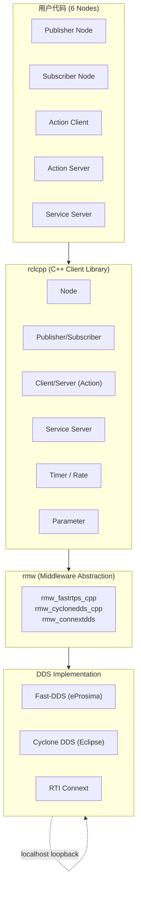
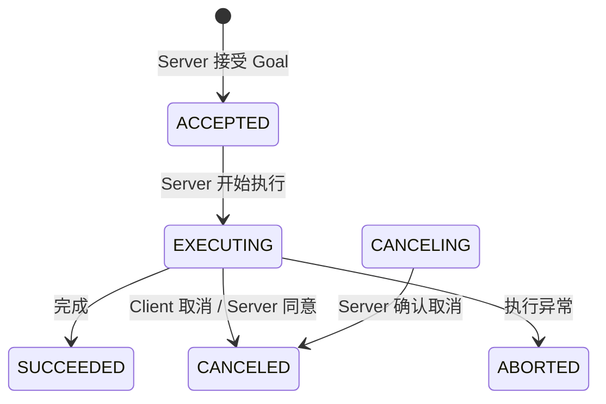

# ROS2 Framework & API 解读

## 1. ROS2 架构总览



**关键抽象层：**

| 层 | 职责 | 本项目涉及 |
|----|------|-----------|
| rclcpp | C++ API：Node, Publisher, Subscription, Action Client/Server, Timer | 6 个节点全部使用 |
| rcl | C 语言 API（rclcpp 底层） | 间接调用 |
| rmw | ROS Middleware 接口（抽象 DDS 实现） | Phase 6.5 对比测试 |
| DDS | 发现、QoS 匹配、序列化/反序列化 | Fast-DDS 默认使用 |

**官方文档入口：**
- [ROS2 官方文档](https://docs.ros.org/en/jazzy/)
- [rclcpp API 参考](https://docs.ros.org/en/jazzy/p/rclcpp/)
- [rclcpp_action API 参考](https://docs.ros.org/en/jazzy/p/rclcpp_action/)
- [About ROS2 Interfaces](https://docs.ros.org/en/jazzy/Concepts/Basic/About-Interfaces.html)

**社区论坛：**
- [ROS Discourse](https://discourse.ros.org/) — 架构讨论、RFC
- [ROS Answers](https://answers.ros.org/) — 具体问题（注意选 ROS2 标签）
- [ROS2 GitHub](https://github.com/ros2) — 源码 + Issue 追踪

---

## 2. 核心 API 用法

### 2.1 Node — 一切的基础

```cpp
class MyNode : public rclcpp::Node {
public:
    MyNode() : Node("node_name") {}  // 节点名 = ROS2 图中的唯一标识
};
```

**生命周期：**
```
Node 构造 → rclcpp::spin(node) → Node 析构
   ↑            ↑ (阻塞)           ↑
注册通信通道   等待消息/事件      自动清理所有 Publisher/Subscriber
```

### 2.2 Topic — Publisher/Subscriber（单向流）

**适用场景：** 持续数据流（传感器数据、融合结果），生产者不关心消费者。

```cpp
// ── Publisher 端 ──
publisher_ = this->create_publisher<MsgType>("topic_name", rclcpp::QoS(10).best_effort());
publisher_->publish(msg);

// ── Subscriber 端 ──
subscription_ = this->create_subscription<MsgType>(
    "topic_name", rclcpp::QoS(10).best_effort(),
    [this](MsgType::SharedPtr msg) { /* 处理消息 */ });
```

**QoS 选型决策表：**

| QoS | 行为 | 适用传感器 | 本项目 |
|------|------|-----------|--------|
| `best_effort` | 可能丢帧，延迟低 | LiDAR, Camera | `/sensor/lidar`, `/sensor/camera` |
| `reliable` | 保证送达，延迟略高 | IMU, 控制指令 | `/sensor/imu`, `/perception/objects` |
| `keep_last(N)` | 只保留最近 N 条 | 所有 Topic | 全局 `QoS(N)` |

### 2.3 Service — Request/Response（一问一答）

**适用场景：** 短耗时、一次性的操作（参数设置、查询状态）。

```cpp
// ── Server 端 ──
service_ = this->create_service<SrvType>(
    "service_name",
    [this](const Request::SharedPtr req, Response::SharedPtr resp) {
        resp->success = true;
    });

// ── Client 端 ──
auto future = client_->async_send_request(request);
// ... 等待 future
```

### 2.4 Action — Goal/Feedback/Result（长耗时双向）

**适用场景：** 长耗时操作（导航、运动），需实时反馈进度 + 支持取消。

```cpp
// ── Server 端 ──
action_server_ = rclcpp_action::create_server<ActionType>(
    this, "action_name",
    handle_goal,     // GoalResponse  — 接受/拒绝 goal
    handle_cancel,   // CancelResponse — 接受/拒绝取消
    execute);        // void — 主执行体（独立线程）

// execute() 内部：
goal_handle->publish_feedback(feedback);   // 报告进度
goal_handle->succeed(result);              // 成功完成
goal_handle->canceled(result);             // 已取消
goal_handle->abort(result);                // 异常中止

// ── Client 端 ──
client_ = rclcpp_action::create_client<ActionType>(this, "action_name");
client_->wait_for_action_server(timeout);
client_->async_send_goal(goal, options);   // 发送 goal
```

**Action 三阶段状态机：**



### 2.5 Timer — 周期回调

```cpp
// 两种用法：
timer_ = this->create_wall_timer(100ms, [this]() { callback(); });  // 固定周期
rclcpp::Rate rate(10); rate.sleep();                                 // 循环内控制频率
```

**区别：** `create_wall_timer` 适用于单次回调的周期性触发；`Rate::sleep()` 适用于 while 循环内手动控制节奏（如 `execute()` 中的运动步进）。

---

## 3. 本项目抽取的设计模式

### 3.1 静态库 + 薄入口模式

```
CMakeLists.txt:
  add_library(robot_middleware_lib STATIC  src/*_node.cpp)  ← 业务逻辑
  add_executable(lidar_node  src/lidar_main.cpp)            ← 只含 main()

优点：
  - 所有节点共享编译产物，链接快
  - 测试工程可独立 link 静态库 + gtest
  - 生产代码和入口代码分离，符合 Google Style
```

### 3.2 回调转发模式

```cpp
// 构造时用 lambda 转发，保持回调函数签名干净
sub_lidar_ = this->create_subscription<LidarScan>(
    "/sensor/lidar", qos,
    [this](LidarScan::SharedPtr msg) { lidar_callback(msg); });

// 而非直接写复杂逻辑在 lambda 里
```

### 3.3 类型别名集中管理

```cpp
// aliases.hpp — 所有 .cpp 共享的短名映射
using LidarScan         = rrm::LidarScan;
using MoveToPose        = rra::MoveToPose;
using ServerGoalHandle  = rclcpp_action::ServerGoalHandle<MoveToPose>;
using ClientGoalHandle  = rclcpp_action::ClientGoalHandle<MoveToPose>;
```

### 3.4 缓存-融合模式 (fusion_node)

```cpp
// 每个 subscriber 回调只做一件事：更新缓存
void lidar_callback(msg) { lidar_cache_ = msg; }

// timer 回调做融合决策
void timer_callback() {
    if (!lidar_cache_ || !imu_cache_ || !camera_cache_) return;  // 未就绪
    // ... 融合逻辑
}
```

### 3.5 ClientGoalHandle vs ServerGoalHandle 区分

| | ClientGoalHandle | ServerGoalHandle |
|----|----|----|
| 所在侧 | 客户端 (decision) | 服务端 (motor_ctrl) |
| 获取方式 | `async_send_goal` 回调参数 | `create_server` 的 `execute` 参数 |
| 可用操作 | 只读查询（状态、结果） | `publish_feedback`, `succeed`, `canceled`, `abort` |
| 消息类型 | `action_msgs` 内部类型 | 与 client 相同 + 控制方法 |

---

## 4. 工作流记录

### Session 1 — 项目初始化 (2025-06-15)

- 创建项目骨架：package.xml, CMakeLists.txt, .gitignore, LICENSE
- 定义全部接口：3 个 msg, 1 个 srv, 1 个 action
- 创建 PRD、Design Doc、Cost Estimation 文档
- 决策：AMR 仓储物流场景，3-keyword 定位（协议级定制, 系统全栈, 可交付）

### Session 2 — CI 基础设施 (2025-06-16)

- 编写 `setup_deps.sh`（4 轮 review）
- 编写 `build.sh`（workspace 自动检测）
- 搭建独立测试工程（CMakeLists.txt + test.sh）
- 编写 `.github/workflows/test.yml`
- 编译通过后搭建 6 节点骨架

### Session 3 — 传感器层 (2025-06-16)

- 实现 lidar_node: 10Hz, best_effort, sin/cos 模拟 SICK TiM781
- 实现 imu_node: 100Hz, reliable, 噪声模拟 Bosch BMI088
- 实现 camera_node: 5Hz, best_effort, 随机像素模拟 Intel RealSense D435
- 引入 `aliases.hpp` 统一类型别名

### Session 4 — 融合 + 决策 + 执行层 (2025-06-17)

- 实现 fusion_node: 3 路缓存 → 聚类提取 → PerceptionObjects
- 实现 decision_node: 订阅感知 → Action Client → 发送 MoveToPose goal
- 实现 motor_ctrl_node: Action Server（直线插值）+ Service Server（参配）
- 设计文档补充逐节点业务逻辑章节
- 回答 MoveToPose 概念、GoalHandle 概念、命名空间可读性优化

### 关键决策记录

| 决策 | 时间 | 结论 |
|------|------|------|
| 消息字段粒度 | 2025-06-15 | 只加传感器数据手册有依据的字段，不加算法输出字段 |
| 奥卡姆剃刀 vs 预留字段 | 2025-06-15 | "不加你不理解的东西" — 领域知识是加字段的前提 |
| UUID vs 语义 include guard | 2025-06-16 | 语义 guard，人和工具都能读 |
| using 别名放 .cpp 不放 .hpp | 2025-06-17 | Google Style：头文件不用 using，.cpp 可用 |
| 设计文档 5.5 节 | 2025-06-17 | 每个节点的业务逻辑伪代码写入设计文档 |
