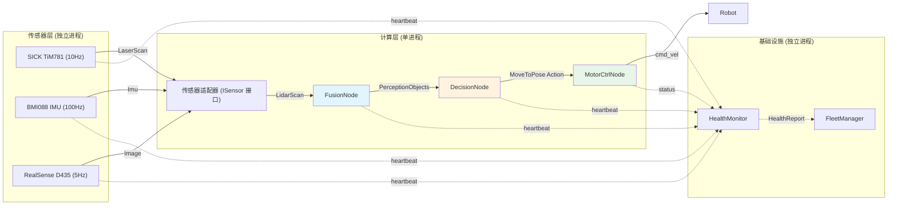
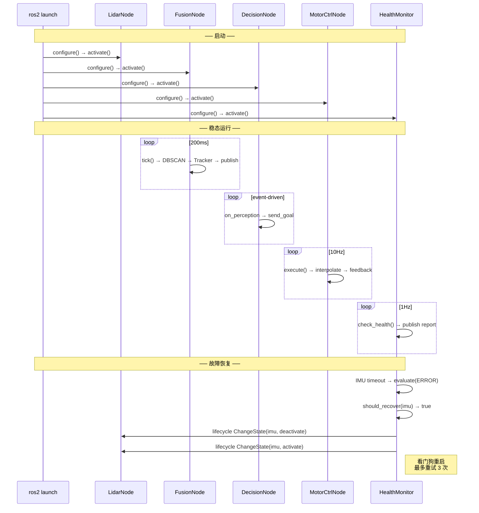
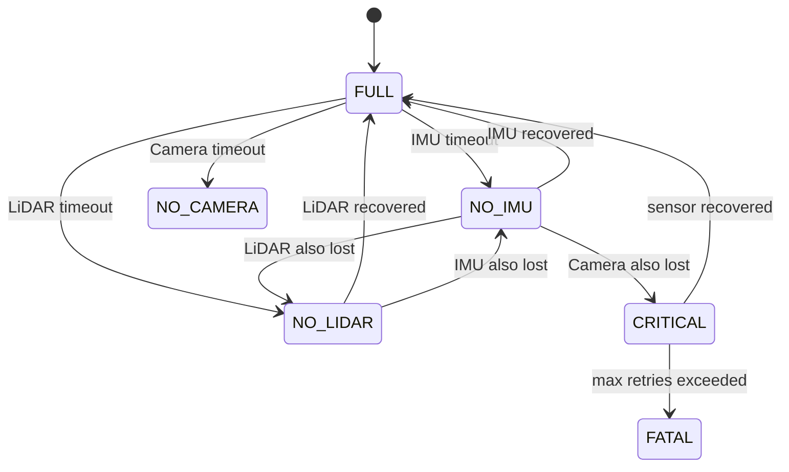

# 总体架构

> 本文档描述系统级设计——数据如何流动、控制如何传递、状态如何变迁。
> 各模块内部细节见 [subsystems/](subsystems/) 目录。

---

## 一、数据流（感知→执行链路）



| 边 | 类型 | Topic / 接口 | QoS |
|---|------|-------------|-----|
| 传感器 → HAL | DDS | `/sensor/lidar`, `/sensor/imu`, `/sensor/camera` | best_effort / reliable |
| HAL → Fusion | 进程内 | `ISensor<DataType>::read()` | — |
| Fusion → Decision | DDS | `/perception/objects` | reliable |
| Decision → Motor | DDS Action | `/cmd/move_to_pose` | — |
| 各节点 → Health | DDS | `/*/heartbeat`, `/cmd/status` | reliable |
| Health → Fleet | DDS | `/health/report` | reliable |
| Motor → Robot | (planned) | `/cmd_vel` | — |

---

## 二、控制流（生命周期 + 故障恢复）



---

## 三、状态流（传感器降级）



| 等级 | 含义 | 融合行为 |
|------|------|---------|
| FULL | 全部传感器正常 | DBSCAN 聚类 + KF 更新 + Tracker 关联 |
| NO_IMU | IMU 缺失 | KF predict 用加速度=0，其余正常 |
| NO_LIDAR | LiDAR 缺失 | 无聚类输出，Tracker 仅 predict |
| NO_CAMERA | Camera 缺失 | 不影响（LiDAR 为主传感器） |
| CRITICAL | ≥2 个传感器缺失 | 无融合，输出空 |
| FATAL | 看门狗重试耗尽 | 系统进入 inactive |

---

## 四、模块索引

| 模块 | 数据流 | 控制流 | 状态流 | 子系统文档 |
|------|:---:|:---:|:---:|------|
| 传感器管线 | ✅ | — | — | [sensor-pipeline.md](subsystems/sensor-pipeline.md) |
| 融合管线 | ✅ | — | ✅ 降级 | [fusion-pipeline.md](subsystems/fusion-pipeline.md) |
| 决策管线 | ✅ | ✅ Action | — | [decision-pipeline.md](subsystems/decision-pipeline.md) |
| 执行管线 | ✅ | ✅ Action | — | [actuation-pipeline.md](subsystems/actuation-pipeline.md) |
| 健康监控 | — | ✅ 看门狗 | — | [health-monitor.md](subsystems/health-monitor.md) |
| 可观测性 | — | — | — | [observability.md](subsystems/observability.md) |
| 硬件抽象层 | ✅ | — | — | [hal-design.md](../guides/hal-design.md) |

---

## 五、DDD 分层视图

```
┌──────────────────────────────────────────────────────┐
│ domain/        纯业务逻辑，零 ROS2 依赖               │
│  perception/   KF, DBSCAN, Tracker, Degradation      │
│  planning/     TargetSelector, PreemptPolicy          │
│  execution/    Interpolator                           │
│  monitoring/   HeartbeatAnalyzer, RecoveryPolicy      │
├──────────────────────────────────────────────────────┤
│ application/   用例编排，依赖 domain                    │
│  PerceptionService, PlanningService                   │
│  ExecutionService, MonitoringService                  │
├──────────────────────────────────────────────────────┤
│ infrastructure/  ROS2 适配器 (唯一可依赖 rclcpp)        │
│  FusionNode, DecisionNode, MotorCtrlNode              │
│  HealthMonitorNode, FleetManagerNode                  │
│  sensors/ SimulatedLidar, SickTiM781Adapter, Factory  │
├──────────────────────────────────────────────────────┤
│ observability/  横切关注点                             │
│  RingBuffer, MetricsRegistry, Tracer, LogWorker       │
└──────────────────────────────────────────────────────┘
```

编译期强制：`domain/` 不 `#include` 任何 ROS2 头文件。违反此规则 → `colcon build` 失败。

---

## 六、进程模型

```
PID 1: lidar_node         — 独立 (传感器驱动故障隔离)
PID 2: imu_node           — 独立
PID 3: camera_node        — 独立
PID 4: compute_container  — fusion + decision + motor_ctrl (零拷贝, SHM)
PID 5: health_monitor     — 独立 (不能与被监控节点共享命运)
PID 6: fleet_manager      — 独立 (跨 AMR 编排)

8 节点 → 6 进程。计算节点共享进程以消除 DDS 序列化开销。
```

---

## 快捷引用

| 想看什么 | 去哪里 |
|---------|--------|
| 某个模块的内部设计 | [subsystems/](subsystems/) |
| 关键技术决策及备选方案 | [adr/03-adr.md](adr/03-adr.md) |
| DDS QoS 配置 | [guides/06-dds-customization.md](guides/06-dds-customization.md) |
| 可观测性系统设计 | [guides/07-observability-design.md](guides/07-observability-design.md) |
| 可观测性使用指南 | [guides/08-observability-usage.md](guides/08-observability-usage.md) |
| 硬件抽象层设计 | [guides/09-hal-design.md](guides/09-hal-design.md) |
| 项目根目录结构 | [项目 README](../README.md) |
