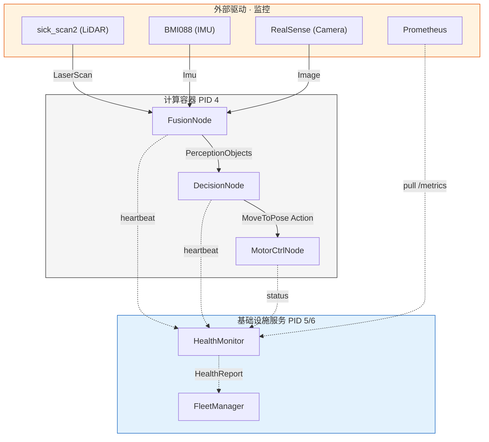
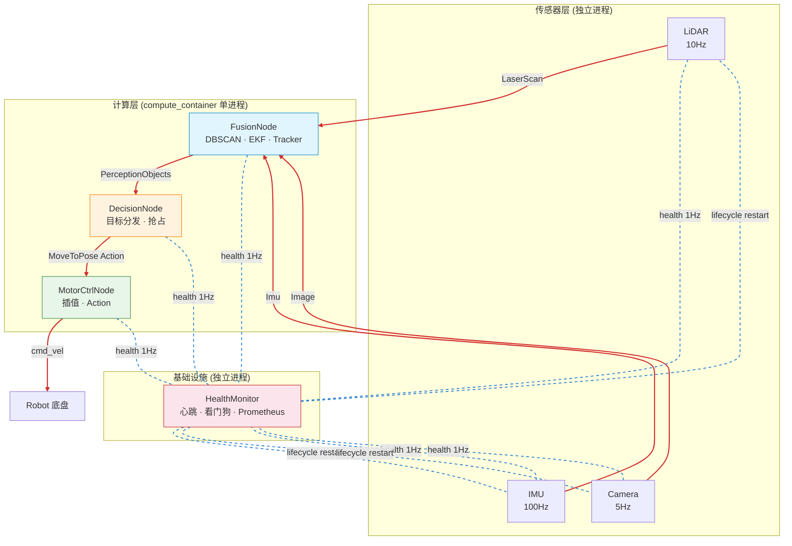
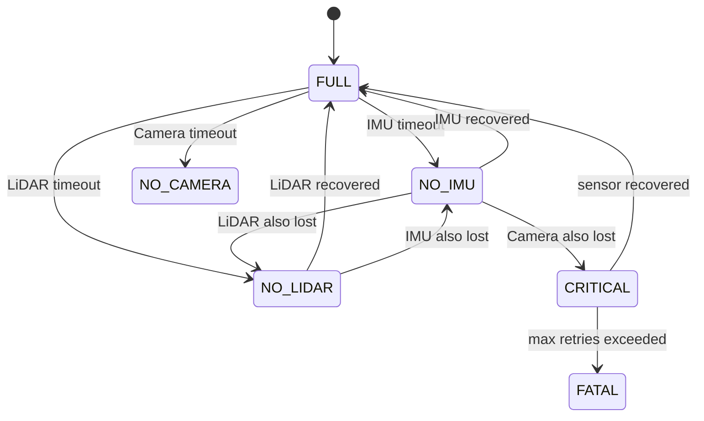
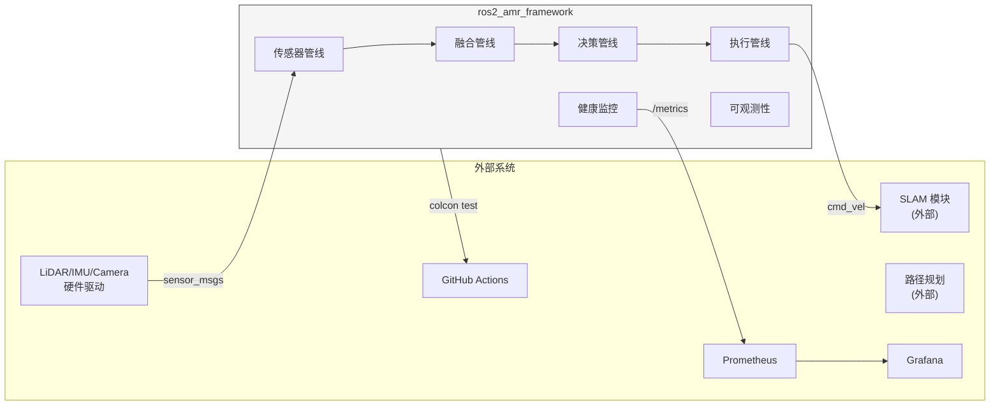
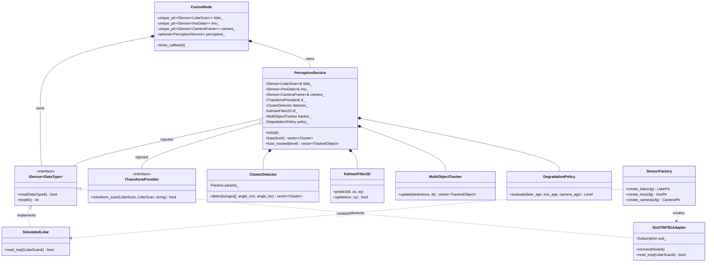

# AMR 系统架构设计说明书

| 属性 | 值 |
|------|-----|
| 版本 | v2.0.0 |
| 最后更新 | 2026-07-19 |
| 作者 | guang |
| 读者 | 技术团队 / 开源社区 |
| 适用范围 | ros2_amr_framework 感知→决策→执行链路。不含 SLAM、路径规划、真实电机驱动。 |
| 参考 | [ITERATION.md](ITERATION.md) · [adr/](adr/) · [subsystems/](subsystems/) · [guides/](guides/) |

### 术语表

| 缩写 | 全称 | 说明 |
|------|------|------|
| DDS | Data Distribution Service | OMG 标准发布-订阅通信协议 |
| HAL | Hardware Abstraction Layer | 硬件抽象层，本项目指 `ISensor<DataType>` 接口 |
| DDD | Domain-Driven Design | 领域驱动设计，本项目四层：domain/application/infrastructure/observability |
| ADR | Architecture Decision Record | 架构决策记录 |
| SHM | Shared Memory | 共享内存，POSIX `shm_open` |
| QoS | Quality of Service | DDS 消息质量策略（reliable/best_effort） |
| KF / EKF | Kalman Filter / Extended KF | 卡尔曼滤波器，本项目 EKF 支持线性+范围-方位测量模型 |
| DBSCAN | Density-Based Spatial Clustering | 密度聚类算法 |
| SPSC | Single Producer Single Consumer | 单生产者单消费者（RingBuffer 队列模式） |
| LCM | LifecycleNode | ROS2 托管节点生命周期接口 |

### 变更记录

| 版本 | 日期 | 变更 |
|------|------|------|
| v1.0 | 2025-06 | 初始设计，7 节点管线 + LifecycleNode |
| v1.1 | 2025-07 | ADR-6 EKF 升级 + 降级策略 + 看门狗 |
| v2.0 | 2026-07 | DDD 四层架构 + M7 可观测 + M8 HAL + DBSCAN+Tracker+TF2 + spdlog |

> 本文档从两个视角描述系统：**软件分层概览** 和 **数据流 / 控制流 / 状态流统一视图**。各模块内部细节见 [subsystems/](subsystems/)。

---

## 一、软件分层与模块构成



| 层 | 说明 | 物理边界 |
|----|------|---------|
| **外部系统** | 传感器驱动、监控采集、可视化 | 独立 ROS2 节点 / 独立容器 |
| **基础设施服务** | 健康监控、集群编排 | 独立进程 (PID 5/6) |
| **计算容器** | 融合→决策→执行管线 | 单进程 (PID 4)，SHM 零拷贝 |
| ⊳ **Application** | 领域业务逻辑 (DDD: domain + application) | 编译期禁止依赖 ROS2 |
| ⊳ **HAL** | 硬件抽象层 (ISensor<T> + SensorFactory) | 内嵌于 FusionNode |
| **横切关注点** | 可观测性、配置管理 | 库形式链接到所有节点 |

---

## 二、系统运行时视图



> 红色实线 = 数据流 &nbsp;|&nbsp; 蓝色虚线 = 控制流 &nbsp;|&nbsp; 状态流见下方状态图

### 数据流（感知→执行链路明细）

| 边 | 类型 | Topic / 接口 | QoS |
|---|------|-------------|-----|
| 传感器 → Fusion | DDS | `/sensor/lidar`, `/sensor/imu`, `/sensor/camera` | best_effort / reliable |
| Fusion → Decision | DDS | `/perception/objects` | reliable |
| Decision → Motor | DDS Action | `/cmd/move_to_pose` | — |
| 各节点 → Health | DDS | `/*/heartbeat`, `/cmd/status` | reliable |
| Health → Fleet | DDS | `/health/report` | reliable |
| Motor → Robot | (planned) | `/cmd_vel` | — |

### 控制流（关键场景）

| 场景 | 触发方式 | 涉及节点 |
|------|---------|---------|
| 系统启动 | `ros2 launch` → LifecycleNode configure→activate | 全部 6 节点 |
| 传感器故障恢复 | HealthMonitor 检测 heartbeat timeout → ChangeState(deactivate→activate) | Health + 故障传感器 |
| Action 生命周期 | Goal → (Feedback × N) → Result / Cancel | Decision → Motor |
| 抢占 | 新目标到达时旧目标未完成 → cancel + send new goal | Decision |

### 状态流（传感器降级）



| 等级 | 融合行为 |
|------|---------|
| FULL | DBSCAN 聚类 + KF 更新 + Tracker 关联 |
| NO_IMU | KF predict 用加速度=0，其余正常 |
| NO_LIDAR | 无聚类输出，Tracker 仅 predict |
| NO_CAMERA | 不影响（LiDAR 为主传感器） |
| CRITICAL | ≥2 传感器缺失，无融合输出 |
| FATAL | 看门狗重试耗尽，系统 inactive |

---

## 三、系统边界



### 外部依赖清单

| 依赖 | 提供方 | 许可证 | 版本 | 用途 |
|------|--------|:---:|------|------|
| Fast-DDS | eProsima | Apache 2.0 | 2.14+ | DDS 通信中间件 |
| rclcpp | Open Robotics | Apache 2.0 | Jazzy | ROS2 客户端库 |
| tf2_ros | Open Robotics | BSD-3 | 0.36+ | 坐标变换 |
| spdlog | Gabi Melman | MIT | 1.12+ | 异步日志 |
| Prometheus | CNCF | Apache 2.0 | — | 指标采集（HTTP pull） |
| Gazebo Harmonic | Open Robotics | Apache 2.0 | 8.x+ | 物理仿真 |
| GoogleTest | Google | BSD-3 | 1.14+ | 单元测试框架 |
| LTTng | EfficiOS | LGPL 2.1 | 2.13+ | 内核级 tracepoint |

### 系统输入 / 输出

| 方向 | 项目 | 类型 | 周期 |
|:---:|------|------|:---:|
| 入 | LiDAR 扫描 | `sensor_msgs/LaserScan` | 10Hz |
| 入 | IMU 数据 | `sensor_msgs/Imu` | 100Hz |
| 入 | Camera 图像 | `sensor_msgs/Image` | 5Hz |
| 入 | 配置文件 | `sensors.yaml` / `params.yaml` | 启动时 |
| 出 | 感知结果 | `PerceptionObjects` | 5Hz |
| 出 | 导航目标 | `MoveToPose` (Action) | 事件驱动 |
| 出 | 健康报告 | `HealthReport` | 1Hz |
| 出 | Prometheus 指标 | `:9090/metrics` (HTTP) | scrape 周期 |
| 出 | 结构化日志 | stdout JSON | 持续 |

### 范围排除

- ❌ SLAM（同步定位与建图）
- ❌ 路径规划
- ❌ 真实电机驱动（使用 Gazebo 仿真）
- ❌ 多 AMR 集群调度（FleetManager 为骨架实现）
- ❌ 硬件安全回路（ISO 13849 功能安全）

---

## 四、模块索引

| 模块 | 数据流 | 控制流 | 状态流 | 子系统文档 |
|------|:---:|:---:|:---:|------|
| 传感器管线 | ✅ | — | — | [sensor-pipeline.md](subsystems/sensor-pipeline.md) |
| 融合管线 | ✅ | ✅ TF 变换 | ✅ 降级 | [fusion-pipeline.md](subsystems/fusion-pipeline.md) |
| 决策管线 | ✅ | ✅ Action | — | [decision-pipeline.md](subsystems/decision-pipeline.md) |
| 执行管线 | ✅ | ✅ Action | — | [actuation-pipeline.md](subsystems/actuation-pipeline.md) |
| 健康监控 | — | ✅ 看门狗 | — | [health-monitor.md](subsystems/health-monitor.md) |
| 可观测性 | — | — | — | [observability.md](subsystems/observability.md) |
| 通信中间件 | ✅ | — | — | [communication.md](subsystems/communication.md) |
| 配置管理 | — | ✅ | — | [configuration.md](subsystems/configuration.md) |
| 硬件抽象层 | ✅ | — | — | [hal-design.md](../guides/hal-design.md) |
| 非功能约束 | — | — | — | [non-functional.md](non-functional.md) |
| 接口规范 | ✅ | ✅ | — | [interfaces.md](interfaces.md) |
| 风险矩阵 | — | — | — | [risks.md](risks.md) |
| 数据架构 | ✅ | — | — | [data-architecture.md](data-architecture.md) |
| 部署运维 | — | ✅ | — | [deployment.md](deployment.md) |
| 附录 | — | — | — | [appendix.md](appendix.md) |

---

### 设计原则

| # | 原则 | 说明 | 体现 |
|---|------|------|------|
| 1 | **分层解耦** | domain 层零 ROS2 依赖，编译期强制 | DDD 四层架构 |
| 2 | **依赖倒置** | domain 定义接口，infrastructure 实现 | `ISensor<T>` / `ITransformProvider` |
| 3 | **实时与业务隔离** | 热路径零 malloc/零 syscall | RingBuffer SPSC / `std::atomic` metrics |
| 4 | **可观测内置** | Trace/Metrics/Log 不是事后添加，是设计的一部分 | TracerContext + shared_metrics() + LOG_OBS |
| 5 | **故障隔离** | 传感器驱动 crash 不传播到融合管线 | 6 个独立进程 + LifecycleNode 看门狗 |
| 6 | **编译期安全** | 类型错误在 `colcon build` 时发现，不是运行时 | `static_assert` + `constexpr` + 模板策略 |
| 7 | **约定优于配置** | 默认值覆盖 80% 场景，显式配置覆盖剩余 20% | `sensors.yaml` 默认模拟，切换改一行 |

### 技术选型对比

| 维度 | 选择 | 备选方案 | 选择理由 |
|------|------|---------|---------|
| DDS | Fast-DDS | CycloneDDS / RTI Connext | ROS2 默认 RMW，XML QoS profile 粒度够细，SHM 传输成熟 |
| 日志 | spdlog async (M9) | 自研 RingBuffer (M7) | spdlog 工程完备性更好（日志轮转/多 sink/级别过滤）；RingBuffer 延迟更确定（~10ns vs ~100ns），适合实时约束严格场景 |
| 聚类 | DBSCAN | scan-line 角度聚类 | 笛卡尔空间距离，分离相邻物体，显式噪点标记 |
| 状态估计 | 自研 EKF | robot_localization / FusionCore | 4 维状态对仓库 AMR 足够；Joseph 形式 + Mahalanobis 离群值拒绝达到商用级 |
| 传感器接口 | `ISensor<T>` 虚接口注入 | CRTP 模板参数 / SensorRegistry | 依赖注入兼顾灵活性和类型安全，传感器数量少时比注册表简洁 |
| 覆盖报告 | lcov + genhtml | gcovr / llvm-cov | lcov 与 colcon/gcc 集成最成熟，CI 可用 |

---

## 五、DDD 分层视图

```
┌──────────────────────────────────────────────────────┐
│ domain/        纯业务逻辑，零 ROS2 依赖               │
│  perception/   KF, DBSCAN, Tracker, Degradation      │
│  planning/     TargetSelector, PreemptPolicy          │
│  execution/    Interpolator                           │
│  monitoring/   HeartbeatAnalyzer, RecoveryPolicy      │
├──────────────────────────────────────────────────────┤
│ application/   用例编排，依赖 domain                    │
│  PerceptionService, PlanningService                   │
│  ExecutionService, MonitoringService                  │
├──────────────────────────────────────────────────────┤
│ infrastructure/  ROS2 适配器 (唯一可依赖 rclcpp)        │
│  FusionNode, DecisionNode, MotorCtrlNode              │
│  HealthMonitorNode, FleetManagerNode                  │
│  sensors/ SimulatedLidar, SickTiM781Adapter, Factory  │
├──────────────────────────────────────────────────────┤
│ observability/  横切关注点                             │
│  RingBuffer, MetricsRegistry, Tracer, LogWorker       │
└──────────────────────────────────────────────────────┘
```

编译期强制：`domain/` 不 `#include` 任何 ROS2 头文件。违反此规则 → `colcon build` 失败。

### 类关系图



| 关系 | 含义 |
|------|------|
| `*--` | 组合（拥有生命周期） |
| `o--` | 聚合（依赖注入，不拥有生命周期） |
| `<|..` | 接口实现 |
| `..>` | 依赖（创建/使用） |

---

## 六、进程模型

```
PID 1: lidar_node         — 独立 (传感器驱动故障隔离)
PID 2: imu_node           — 独立
PID 3: camera_node        — 独立
PID 4: compute_container  — fusion + decision + motor_ctrl (零拷贝, SHM)
PID 5: health_monitor     — 独立 (不能与被监控节点共享命运)
PID 6: fleet_manager      — 独立 (跨 AMR 编排)

8 节点 → 6 进程。计算节点共享进程以消除 DDS 序列化开销。
```

---

## 快捷引用

| 想看什么 | 去哪里 |
|---------|--------|
| 迭代计划（逐章推进） | [ITERATION.md](ITERATION.md) |
| 某个模块的内部设计 | [subsystems/](subsystems/) |
| 关键技术决策及备选方案 | [adr/03-adr.md](adr/03-adr.md) |
| DDS QoS 配置 | [guides/06-dds-customization.md](guides/06-dds-customization.md) |
| 可观测性系统设计 | [guides/07-observability-design.md](guides/07-observability-design.md) |
| 可观测性使用指南 | [guides/08-observability-usage.md](guides/08-observability-usage.md) |
| 硬件抽象层设计 | [guides/09-hal-design.md](guides/09-hal-design.md) |
| 项目根目录结构 | [项目 README](../README.md) |
