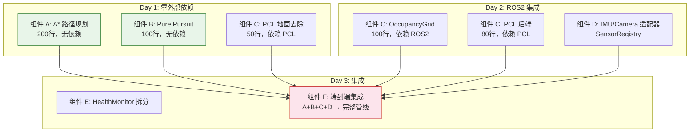

# 组件 Gap 分析 & 并行开发计划

> 审计日期：2026-07-19
> 对比基准：Paxini JD（运动控制+路径规划+感知）+ 商用 AMR 标准链路
> 方法：遍历 include/ + src/ 的实际代码，与方案文档逐项比对

---

## 一、实际代码完成度审计

| 组件 | include/ | src/ | 完成度 | 商用差距 |
|------|:---:|:---:|:---:|------|
| **感知-聚类** | `cluster_detector.hpp` (DBSCAN) | — (header-only) | ✅ 100% | ⚠️ 缺地面点去除 + PCL 后端 |
| **感知-滤波** | `kalman_filter.hpp` (EKF) | — | ✅ 100% | — |
| **感知-跟踪** | `tracker.hpp` | — | ✅ 100% | — |
| **感知-降级** | `degradation_policy.hpp` | — | ✅ 100% | — |
| **传感器 HAL** | `sensor_interface.hpp`, `simulated_sensors.hpp`, `sick_tim781_adapter.hpp`, `sensor_factory.hpp` | — (header-only) | ⚠️ 80% | 缺 IMU/Camera 真实适配器 |
| **融合编排** | `perception_service.hpp` | — | ✅ 100% | — |
| **决策** | `planning_service.hpp`, `target_selector.hpp`, `preempt_policy.hpp` | — | ⚠️ 60% | 目标选择过于简单（选第一个物体） |
| **执行** | `execution_service.hpp`, `interpolator.hpp` | — | ⚠️ 60% | 缺路径跟踪层（Pure Pursuit） |
| **路径规划** | ❌ **不存在** | ❌ | 0% | **完全空白** |
| **运动控制-跟踪** | ❌ **不存在** | ❌ | 0% | **完全空白** |
| **PCL 后端** | ❌ **不存在** | ❌ | 0% | **完全空白** |
| **ROS2 适配** | `fusion_node.hpp`, `decision_node.hpp`, `motor_ctrl_node.hpp`, `health_monitor_node.hpp`, `fleet_manager_node.hpp` | ✅ 全部实现 | ✅ 100% | health_monitor 需 SRP 拆分 |
| **坐标变换** | `transform_provider.hpp`, `tf2_transform_provider.hpp` | — | ✅ 100% | — |
| **可观测性** | `observability/*` | — (header-only) | ✅ 100% | — |
| **配置** | `sensor_factory.hpp` (hardcoded) | — | ⚠️ 50% | 缺 SensorRegistry 插件化 |

**关键发现**：感知（DBSCAN+KF+Tracker）和基础设施（ROS2 适配+观测+TF2）是完整的。**路径规划和运动控制（路径跟踪层）的代码为零**——这是方案文档中反复讨论但从未实现的。

---

## 二、按组件独立开发的并行计划

### 组件划分原则

- 每个组件有独立的 `.hpp` 入口、独立的 `quality/src/test_*.cpp` 测试
- 组件间依赖仅通过接口（`ISensor<T>` / `ITransformProvider`）——可独立编译测试
- 开发顺序可以并行——组件 A 不阻塞组件 B

---

### 组件 A：路径规划（P0，1d，零外部依赖）

| 文件 | 说明 |
|------|------|
| `domain/planning/astar_planner.hpp` | A* 搜索，~200 行。输入 `OccupancyGrid`，输出 `vector<Waypoint>` |
| `quality/src/test_astar.cpp` | 空 grid/简单障碍/起点=终点/无路径 四个场景 |

- [ ] 不依赖 ROS2，GoogleTest 直接测
- [ ] 接口：`std::vector<Waypoint> plan(const OccupancyGrid&, const Pose&, const Pose&)`

---

### 组件 B：运动控制（P0，0.5d，零外部依赖）

| 文件 | 说明 |
|------|------|
| `domain/execution/pure_pursuit.hpp` | Pure Pursuit 路径跟踪，~100 行。输入路径 + 当前位姿，输出 `cmd_vel` |
| `quality/src/test_pure_pursuit.cpp` | 直线路径/曲线路径/终点到达 三个场景 |

- [ ] 不依赖 ROS2
- [ ] 接口：`Twist track(const std::vector<Waypoint>& path, const Pose& current, float lookahead)`

---

### 组件 C：感知增强（P0，0.5d，依赖 PCL）

| 文件 | 说明 |
|------|------|
| `domain/perception/ground_removal.hpp` | PCL `SACSegmentation` 封装，~50 行。输入 `LidarScan`，输出去地面后的 `LidarScan` |
| `infrastructure/sensors/occupancy_adapter.hpp` | PerceptionObjects → `nav_msgs/OccupancyGrid` 转换，~100 行 |
| `domain/perception/pcl_cluster_backend.hpp` | PCL `EuclideanClusterExtraction` 封装，~80 行。作为 DBSCAN 的替代后端 |

- [ ] 策略模式：`IClusterAlgorithm` 接口 → DBSCAN / PCL 双实现
- [ ] 依赖 PCL（CMake：`find_package(PCL REQUIRED)`）

---

### 组件 D：传感器接入增强（P1，1d）

| 文件 | 说明 |
|------|------|
| `infrastructure/sensors/bmi088_imu_adapter.hpp` | Bosch BMI088 IMU 适配器（订阅 `/imu/data`），~60 行 |
| `infrastructure/sensors/realsense_d435_adapter.hpp` | Intel RealSense D435 适配器（订阅 `/camera/color/image_raw`），~60 行 |
| `infrastructure/sensors/sensor_registry.hpp` | 插件注册机制（`REGISTER_SENSOR` 宏），替代 SensorFactory if-else，~80 行 |

- [ ] 适配器接口不变——`ISensor<T>` 已定义
- [ ] SensorRegistry 需解决 C++ 无反射的问题——宏 + 静态注册表

---

### 组件 E：HealthMonitor 拆分 + OTA（P2，2d）

| 文件 | 说明 |
|------|------|
| `infrastructure/prometheus_http_server.hpp/.cpp` | 从 health_monitor_node 拆出，~150 行 |
| `infrastructure/diagnostics_publisher.hpp` | 从 health_monitor_node 拆出，~50 行 |
| `domain/monitoring/evidence_collector.hpp` | 故障时自动抓 Prometheus 快照 + log 截取，~100 行 |

- [ ] 解决唯一红线：health_monitor_node.cpp 从 493 → <250 行

---

### 组件 F：端到端集成（P0 收尾，0.5d）

| 文件 | 说明 |
|------|------|
| `perception_service.hpp` | 更新 `tick()` 调用 ground_removal + PCL 后端（策略模式） |
| `decision_node.cpp` | 调 A* planner → 获取路径 → 发给 MotorCtrlNode |
| `motor_ctrl_node.cpp` | 调 Pure Pursuit → 沿路径走 → 输出 cmd_vel |

- [ ] 端到端验证：LiDAR 数据 → 地面去除 → 聚类 → A* 路径 → Pure Pursuit → cmd_vel

---

## 三、并行执行的时间线

```
            Day 1          Day 2          Day 3
组件 A  ── [A*实现+测试]
组件 B  ── [PurePursuit实现+测试]
组件 C  ── [PCL地面去除] [OccupancyGrid] [PCL后端+策略模式]
组件 D  ───────────────── [IMU适配器] [Camera适配器] [SensorRegistry]
组件 E  ─────────────────────────────── [HealthMonitor拆分]
组件 F  ───────────────────────────────────────────── [端到端集成]
```

| 并行度 | 描述 |
|:---:|------|
| Day 1 | A + B + C 可并行（无相互依赖）。A+B 零外部依赖最轻量，C 需 PCL |
| Day 2 | C 继续 + D 开始。D 需要 ROS2 环境（创建 subscription） |
| Day 3 | E + F。F 依赖 A/B/C 完成——最后集成 |

---

## 四、组件依赖关系图


