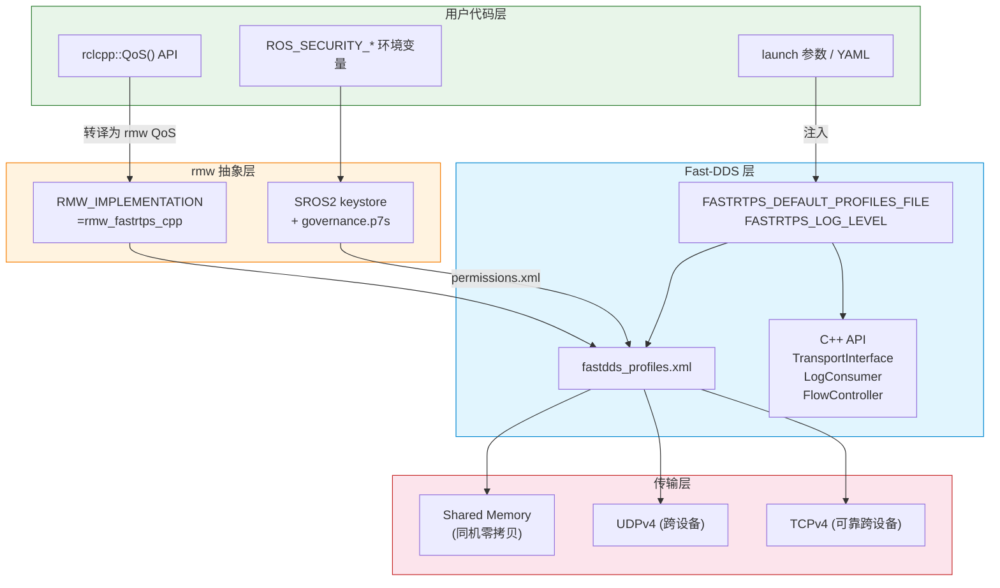

# Fast-DDS 二次开发接口速查

> 列出 Fast-DDS 通信框架中预留的可定制化开发接口，标注**在哪个层配置**、**配置流向**。
> ROS2 软件栈：`rclcpp → rmw → rmw_fastrtps → Fast-DDS → Transport(UDP/SHM/TCP)`

## 〇、配置流向总图



**配置来源分层归类**：

| 9 个定制点 | 在哪配置 | 配置方式 |
|-----------|---------|---------|
| ① SHM↔UDP↔TCP 切换 | Fast-DDS XML | `<builtinTransports>` + `FASTRTPS_DEFAULT_PROFILES_FILE` 环境变量 |
| ② QoS Profile | **ROS2 rclcpp API** | `rclcpp::QoS(10).reliable()` → rmw → Fast-DDS XML 转译 |
| ③ Log 级别 | Fast-DDS 环境变量 | `FASTRTPS_LOG_LEVEL=WARNING`（与 `rcl_logging_spdlog` 独立） |
| ④ Discovery 配置 | Fast-DDS XML | `<discoveryProtocol>SIMPLE\|STATIC</discoveryProtocol>` |
| ⑤ 自定义 Log Consumer | Fast-DDS C++ API | `Log::RegisterConsumer()` |
| ⑥ 自定义 Transport | Fast-DDS C++ API | 实现 `TransportInterface` → 注入 `participant_attr` |
| ⑦ 自定义 TypeSupport | Fast-DDS C++ API 或 fastddsgen | 继承 `TypeSupport` 基类 |
| ⑧ 自定义 Security Plugin | **ROS2 SROS2** + Fast-DDS XML | `ROS_SECURITY_*` 环境变量 + keystore + governance.p7s |
| ⑨ WLP 层修改 | Fast-DDS C++ API | RTPS Submessage 级别控制 |

**关键结论**：只有 **② QoS** 和 **⑧ Security** 两个定制点走 ROS2 层。其余 7 个都是直接在 Fast-DDS 层配置——ROS2 的 rmw 层只是透传，不参与定制。这意味着要做 Fast-DDS 深度定制，**必须理解 Fast-DDS 的 XML 和 C++ API，不能只靠 ROS2 rclcpp 文档**。

---

## 一、传输层定制（Transport Layer）

### 1.1 SHM ↔ UDP ↔ TCP 切换（配置级）

**不需要写代码**。Fast-DDS 自动根据 `locator` 选择传输通道：

```xml
<!-- fastdds_profiles.xml -->
<participant profile_name="amr_participant">
  <rtps>
    <!-- 启用内建传输 -->
    <builtinTransports>DEFAULT</builtinTransports>
    <!-- 或显式指定 SHM + UDP -->
    <builtinTransports>SHM</builtinTransports>
    <builtinTransports>UDPv4</builtinTransports>
  </rtps>
</participant>
```

**传输选择逻辑**（Fast-DDS 内部）：

```
同一台机器：SHM transport (DataSharing) → 零拷贝，进程间直接读写同一块内存
不同机器：UDP transport → CDR 序列化 → socket sendto/recvfrom

/* 源码：src/cpp/rtps/transport/shared_mem/SharedMemTransport.cpp
   is_locator_allowed() 检查 SHM locator 是否属于本机 → 是则走 SHM，否则回退 UDP */
```

**环境变量控制**：

```bash
# 强制禁用 SHM（纯 UDP 传输）
export FASTRTPS_DEFAULT_PROFILES_FILE=config/no_shm_profiles.xml
# 或在 XML 中：
<builtinTransports>UDPv4</builtinTransports>  <!-- 只开启 UDP，不开启 SHM -->
```

### 1.2 自定义 Transport（代码级）

实现 `TransportDescriptorInterface` 抽象接口，注入自定义传输协议（如 CAN 总线、共享内存池、自定义 UDP 封装）：

```
// 关键类（Fast-DDS 2.14+）：
TransportDescriptorInterface      ← 传输描述符
TransportInterface                ← 传输接口（send/recv/open/close）
SharedMemTransport::Descriptor    ← SHM 自定义扩展
UDPv4Transport::Descriptor        ← UDP 自定义扩展
TCPv4Transport::Descriptor        ← TCP 自定义扩展

// 注入方式：
participant_attr.rtps.userTransports.push_back(my_custom_descriptor);
```

**现有自定义传输开源案例**：
- [eprosima/ROS2-SH-Transport](https://github.com/eprosima/ROS2-SH-Transport) — 基于 Unix domain socket 的传输替代
- [Apex.AI 的 iceoryx 集成](https://github.com/eclipse-iceoryx/iceoryx) — 真正的零拷贝 SHM 替代 Fast-DDS 内置 SHM

### 1.3 DataSharing（零拷贝 SHM 配置）

```xml
<data_writer profile_name="zero_copy_writer">
  <data_sharing>
    <kind>AUTOMATIC</kind>  <!-- 自动：同进程内 → SHM，跨进程 → CDR -->
  </data_sharing>
</data_writer>
```

---

## 二、QoS 策略定制（配置级 + 代码级）

### 2.1 XML QoS Profile（配置级）

完整可配置的 QoS 策略（全部可通过 XML 覆盖默认值）：

| QoS Policy | XML 标签 | 说明 |
|-----------|---------|------|
| RELIABILITY | `<reliability>` | RELIABLE / BEST_EFFORT |
| DURABILITY | `<durability>` | VOLATILE / TRANSIENT_LOCAL |
| HISTORY | `<history>` | KEEP_LAST / KEEP_ALL |
| DEPTH | `<depth>` | 队列深度 |
| LIVELINESS | `<liveliness>` | AUTOMATIC / MANUAL_BY_PARTICIPANT |
| DEADLINE | `<deadline>` | 数据更新的最大间隔 |
| LIFESPAN | `<lifespan>` | 数据样本的有效期 |
| PARTITION | `<partition>` | 逻辑分区隔离 |
| OWNERSHIP | `<ownership>` | SHARED / EXCLUSIVE |
| DATA_SHARING | `<data_sharing>` | SHM 传输策略 |

### 2.2 自定义 FlowController（代码级）

控制数据发送速率（限流/整形）：

```
// 关键类：
FlowControllerDescriptor             ← 流控描述符
FlowControllerSchedulerPolicy        ← 调度策略（FIFO / ROUND_ROBIN / PRIORITY）

// 注入：
publisher_attr.flow_controllers.push_back(my_flow_controller);
```

---

## 三、发现协议定制（Discovery Protocol）

### 3.1 静态发现 vs 动态发现（配置级）

```xml
<!-- 动态发现（默认）-->
<participant>
  <rtps><builtin>
    <discovery_config>
      <discoveryProtocol>SIMPLE</discoveryProtocol>  <!-- 或 STATIC -->
    </discovery_config>
  </builtin></rtps>
</participant>
```

静态发现：预配置 endpoint 列表，不需要运行时 DDS discovery。适用于固定拓扑、追求低延迟启动的场景。

### 3.2 自定义 Discovery 通知（代码级）

```
// 关键类：
PDPListener                         ← Participant Discovery Protocol 监听器
EDPListener                         ← Endpoint Discovery Protocol 监听器

// 回调：
on_participant_discovery()           ← 新参与者发现
on_participant_removed()             ← 参与者离开
on_reader_discovery()                ← 新 reader 发现
on_writer_discovery()                ← 新 writer 发现
```

---

## 四、序列化/反序列化定制（TypeSupport）

### 4.1 自动生成（配置级）

```bash
fastddsgen -replace example.idl     # 从 IDL 生成 TypeSupport
```

### 4.2 手动实现 TypeSupport（代码级）

```
// 继承链：
TypeSupport → HelloWorldPubSubType（自动生成）
             → CustomTypeSupport（手动实现）

// 关键虚函数：
serialize(SerializedPayload_t*, void* data)       ← 结构体 → 字节流
deserialize(SerializedPayload_t*, void* data)     ← 字节流 → 结构体
getSerializedSizeProvider(void* data)             ← 计算所需缓冲区大小
```

**适用场景**：
- 自定义 CDR 编码/解码（如压缩、加密）
- 非 IDL 定义的数据类型（如 Protobuf 格式的传感器数据）
- 性能优化（如直接用 memcpy 而非逐字段序列化）

---

## 五、安全插件（Security Plugins）

### 5.1 SROS2 / DDS-Security（配置级 + 代码级）

```
// 三层安全模型：
Authentication Plugin → 身份校验 (X.509 证书)
AccessControl Plugin   → 权限控制 (permissions.xml)
Cryptography Plugin    → 数据加密 (AES-GCM/AES-GMAC)

// XML 配置：
<security>
  <authentication plugin="builtin.PKI-DH" />
  <access_control plugin="builtin.Access-Permissions" />
  <cryptography plugin="builtin.AES-GCM-GMAC" />
</security>
```

**自定义安全插件（代码级）**：实现 `SecurityPluginFactory` 接口注入自定义加密/认证方案。

---

## 六、日志与监控

### 6.1 Log 级别与输出（配置级）

```bash
# 环境变量控制
export FASTRTPS_LOG_LEVEL=WARNING    # ERROR / WARNING / INFO
export FASTRTPS_LOG_FILE=/tmp/dds.log
```

### 6.2 自定义 Log 消费者（代码级）

```
// 关键类：
LogConsumer                         ← 虚基类
Log::RegisterConsumer(unique_ptr<LogConsumer>)   ← 注入自定义 logger
Log::SetVerbosity(Log::Kind::Info)               ← 级别过滤

// 用例：将 Fast-DDS 内部日志路由到 spdlog
class SpdlogConsumer : public LogConsumer {
    void Consume(const Log::Entry& entry) override {
        spdlog::get("dds")->log(entry.kind, "{}", entry.message);
    }
};
```

---

## 七、WLP（Wire Protocol）层面的定制

### 7.1 WLP 层（代码级，高级）

```
// Fast-DDS 的通信模型：
Application Layer   (DataWriter/DataReader)
    ↓
RTPS Layer          (Writer/Reader → RTPSMessageGroup)
    ↓
Transport Layer     (UDP / TCP / SHM)
    ↓
WLP Layer           (Wire Protocol — RTPS Submessage)
```

WLP 层是最底层的扩展点——可以修改 RTPS Submessage 的序列化格式、添加自定义 header、修改分片策略。**通常不需要直接接触**，只在性能极限优化或专用协议适配时需要。

### 7.2 自定义 RTPS Writer/Reader（代码级）

```
/* 关键回调（在 RTPSWriter/RTPSReader 中）：
   - on_publish_acknowledged() — DataWriter 写完成后回调
   - on_new_cache_change_added() — History 有新数据时回调
   - on_sample_lost() — 样本丢失回调
  */
```

---

## 八、扩展接口优先级

| 优先级 | 接口 | 定制方式 | 适用场景 |
|:---:|------|:---:|------|
| 1 | SHM ↔ UDP/TCP 切换 | XML 配置 | 同机/跨设备传输切换 |
| 2 | QoS Profile | XML 配置 | 按 topic 调优 |
| 3 | Log 级别 | 环境变量 | 生产环境日志控制 |
| 4 | Discovery 配置 | XML 配置 | 固定拓扑静态发现 |
| 5 | 自定义 Log Consumer | C++ 接口 | 统一日志管道（→spdlog） |
| 6 | 自定义 Transport | C++ 接口 | 专用硬件/协议 |
| 7 | 自定义 TypeSupport | C++ 接口 | 非 IDL 数据格式 |
| 8 | 自定义 Security Plugin | C++ 接口 | 专用加密方案 |
| 9 | WLP 层修改 | C++ 接口 | 极限性能优化 |

---

## 参考

- [Fast-DDS Transport API (eProsima)](https://fast-dds.docs.eprosima.com/en/latest/fastdds/transport/transport.html)
- [Fast-DDS XML Profiles](https://fast-dds.docs.eprosima.com/en/latest/fastdds/xml_configuration/xml_configuration.html)
- [eProsima ROS2-SH-Transport (自定义传输示例)](https://github.com/eprosima/ROS2-SH-Transport)
- [Apex.AI iceoryx (替代 SHM)](https://github.com/eclipse-iceoryx/iceoryx)
