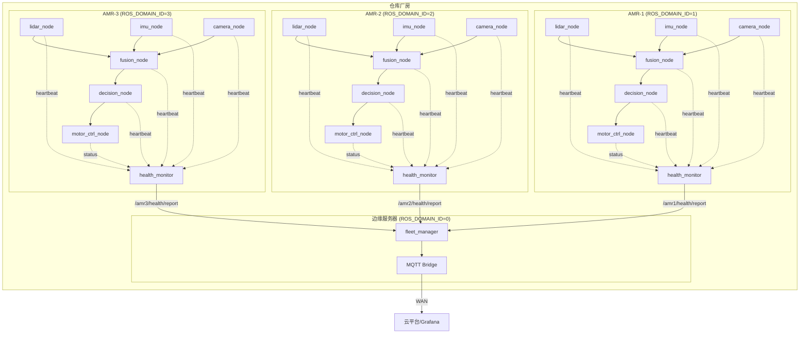

# 自变量机器人 — 多 AMR 部署架构

## 物理部署拓扑



## 关键设计决策

### 1. 为什么每台 AMR 用独立 ROS_DOMAIN_ID？

**问题：** 如果所有 AMR 共享 domain 0，DDS discovery 会互相发现对方所有 topic——AMR-1 的 `/sensor/lidar` 会出现在 AMR-2 的 topic list 里。200 台 AMR = 200×11 = 2200 个 topic 互相可见，DDS discovery 流量爆炸。

**方案：** 每台 AMR 分配独立 `ROS_DOMAIN_ID`（环境变量注入），DDS discovery 只在 domain 内生效。AMR-1 看不到 AMR-2 的 topic，network partition 天然隔离。

### 2. Fleet Manager 怎么跨 domain 通信？

Fleet Manager 运行在 domain 0（控制面），通过 Fast-DDS **Partitions** 或 **Domain Bridge** 订阅其他 domain 的 topic。

简化方案：Fleet Manager 在 domain 0 监听，每台 AMR 的 health_monitor 除了在本 domain 发布，还额外开一个 **跨 domain publisher** 把 `/amrN/health/report` 发到 domain 0。这是"数据面单向出口"模式——只漏出健康信息，不动传感器数据。

### 3. 边缘服务器 vs 云端

| 组件 | 部署位置 | 理由 |
|------|---------|------|
| AMR 7 节点 | 车载工控机（x86/ARM） | 感知-决策-执行闭环不能跨网络——延迟要求 < 10ms |
| Fleet Manager | 边缘服务器（厂房内） | 近实时集群状态（秒级），不依赖公网 |
| MQTT Bridge | 边缘服务器 | 把 DDS 转 MQTT 推云端，做大数据分析和远程监控 |
| Grafana | 云端 | 历史趋势、告警通知、运维大盘 |

### 4. 网络可靠性

```
AMR ←→ 边缘服务器: WiFi 6 / 5G 专网 (低延迟)
边缘服务器 ←→ 云端: 有线以太网 / 专线
```

健康数据是秒级心跳——WiFi 偶尔丢包不影响。传感器数据（LiDAR/IMU/Camera）只在车载内部 DDS 传输，不走网络。

## 部署清单（生产环境）

| 组件 | Docker 容器数 | 说明 |
|------|-------------|------|
| AMR 7 节点 | 1 容器/AMR | 7 个 LifecycleNode 在一个进程内，`network_mode: host` (DDS 需要 UDP multicast) |
| Fleet Manager | 1 容器 | 独立容器，运行在边缘服务器 |
| MQTT Bridge | 1 容器 | 可用 `mqtt_bridge` ROS2 包或自研 |
| Prometheus | 1 容器 | 拉取各 AMR 的 `:9090/metrics` |
| Grafana | 1 容器 | 可视化仪表盘 |

```yaml
# docker-compose.prod.yml (简化版)
services:
  amr1:
    image: ros2_robot_middleware:latest
    environment:
      - ROS_DOMAIN_ID=1
      - AMR_ID=amr1
    network_mode: host

  amr2:
    image: ros2_robot_middleware:latest
    environment:
      - ROS_DOMAIN_ID=2
      - AMR_ID=amr2
    network_mode: host

  fleet_manager:
    image: ros2_robot_middleware:latest
    command: ros2 run ros2_robot_middleware fleet_manager_node
    environment:
      - ROS_DOMAIN_ID=0
    network_mode: host
```

## 面试话术（30 秒版）

> "多 AMR 部署的核心是 DDS 的 network partition 能力——每台 AMR 用独立 `ROS_DOMAIN_ID` 做 topic 隔离，避免 DDS discovery 广播风暴。Fleet Manager 部署在边缘服务器，用 Fast-DDS Partitions 跨 domain 订阅健康报告。传感器数据全程在车载内部闭环，不经过网络——这是实时性和带宽的基本保障。整套架构可以 docker-compose 一键部署，支持水平扩展到 200+ 台 AMR。"
