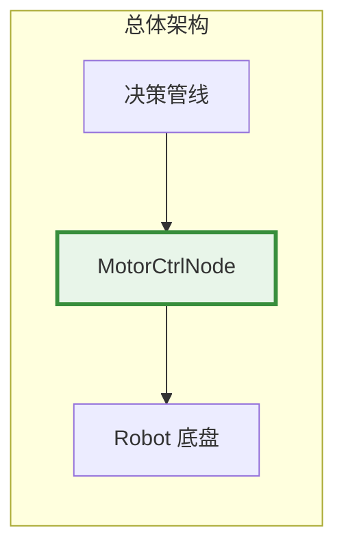
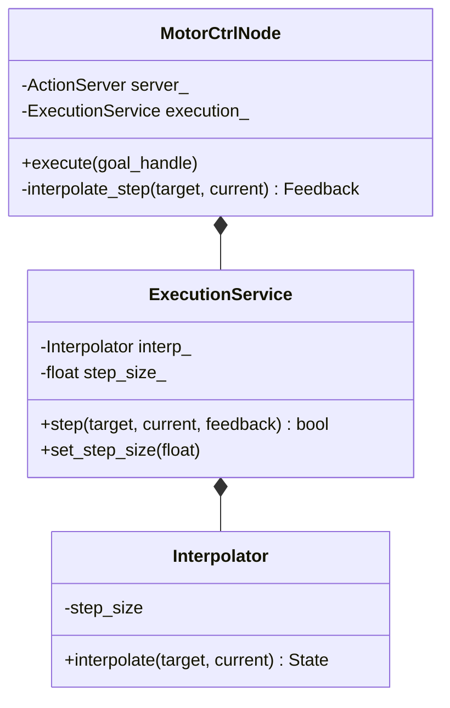
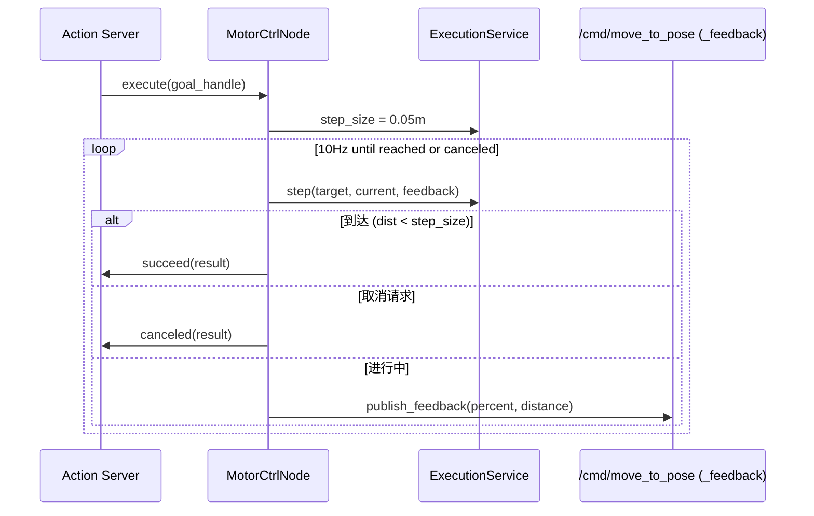

# 执行管线

## 一、位置



## 二、内部结构



| 组件 | 职责 |
|------|------|
| MotorCtrlNode | Action Server + 10Hz 执行循环 + lifecycle |
| ExecutionService | 步进迭代 + 到达判定 |
| Interpolator | 欧几里得插值 (current → target) |

## 三、核心流程



### 插值算法

```
每步：direction = (target - current).normalize()
      step = direction * step_size
      new_pos = current + step

到达条件：|target - current| < step_size

参数：
  step_size = 0.05m (默认，可通过 /cmd/set_param 运行时调)
  频率 = 10Hz (100ms 步进周期)
```

## 四、接口

| 接口 | 类型 | 方向 | 消费方/提供方 |
|------|------|:---:|------|
| `MoveToPose` (Goal/Feedback/Result) | DDS Action | 入 | DecisionNode |
| `SetParam` (step_size) | DDS Service | 入 | 外部调参 / HealthMonitor |
| status | DDS pub | 出 | HealthMonitor |

## 五、边界与降级

| 故障 | 行为 | 恢复 |
|------|------|------|
| 目标在不可达位置 | 持续插值，永不到达（需上层超时） | Decision 发送新 goal 抢占 |
| 取消被拒绝 | 继续执行当前 goal | 下次抢占再试 |
| SetParam 未知参数 | 返回 `success=true, message="Unknown parameter"` | 不阻塞 |

### 性能

| 指标 | 目标 |
|------|:---:|
| 单步耗时 | <0.1ms |
| 到达判定 | 浮点比较, ~ns |

### 测试覆盖

| 测试 | 覆盖 |
|------|------|
| `test_motor_ctrl` (4) | 近距离/远距离到达、SetParam known/unknown |

## 六、参考

- [ADR-3: Action 而非 Service](../adr/03-adr.md#adr-3-电机控制接口--action-而非-service)
