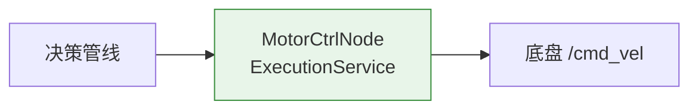
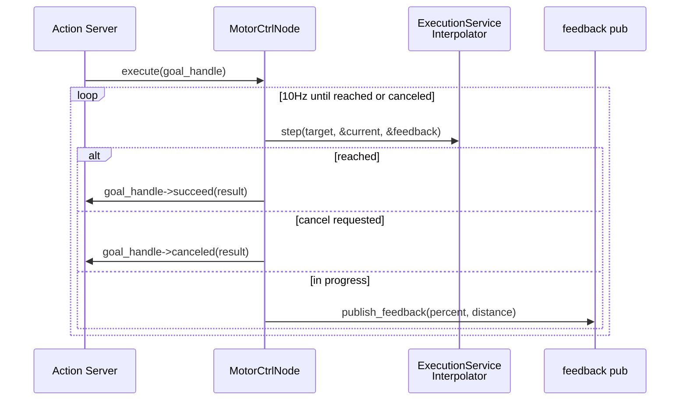

# 执行管线

## 在总体架构中的位置

## 核心业务

接收 `MoveToPose` goal，插值生成轨迹，逐步逼近目标。

### 插值策略

- `step_size = 0.05m`（可通过 SetParam service 运行时调）
- 每步向目标方向移动 step_size，欧几里得距离 < step_size 视为到达
- 10Hz 更新频率，100ms 步进周期

## 依赖

| 依赖 | 说明 |
|------|------|
| `domain/execution/interpolator.hpp` | 步进插值 |
| ROS2 Action Server | `MoveToPose` |
| ROS2 Service | `/cmd/set_param`（运行时调参） |

## 被依赖

- [决策管线](decision-pipeline.md) — 发送 `MoveToPose` goal

## 关键决策

- **Action Server**（而非简单 subscriber）：长时间运行的目标追踪需要 Goal→Feedback→Result 生命周期 + 取消语义
- **SetParam Service**：运行时调 `step_size` 等参数，不需要重新编译或重启
