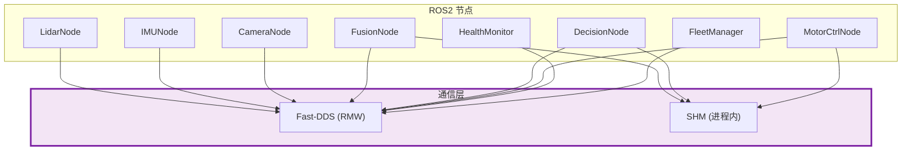

# 通信中间件

## 一、位置



## 二、内部结构

```
compute_container (PID 4, 单进程)
┌──────────────────────────────────────────┐
│  FusionNode  →  DecisionNode  →  MotorCtrlNode   │
│       │               │                │         │
│  shared_ptr (零拷贝)   shared_ptr       shared_ptr│
└──────────────────────────────────────────┘

跨进程 (PID 1/2/3/5/6):
  DDS → Fast-DDS → SHM (同机) / UDP (跨机)
```

| 传输方式 | 适用场景 | 延迟 | 序列化 |
|---------|---------|:---:|:---:|
| `shared_ptr` (进程内) | Fusion→Decision→Motor | <1μs | 无 |
| DDS SHM | 传感器→Fusion (同机) | ~5μs | CDR |
| DDS UDP | 跨设备 | ~100μs | CDR |

## 三、QoS 配置

| Topic | QoS | 原因 |
|------|------|------|
| `/sensor/imu` | RELIABLE, depth=10 | IMU 增量数据，丢失影响 KF |
| `/sensor/lidar` | BEST_EFFORT, depth=10 | 360 点，偶发丢帧不影响 |
| `/sensor/camera` | BEST_EFFORT, depth=10 | 绝对数据，单帧丢失可接受 |
| `/perception/objects` | RELIABLE, depth=10 | 关键链路，不可丢失 |
| `/*/heartbeat` | RELIABLE, depth=10 | 监控数据，不可丢失 |
| `/cmd/status` | RELIABLE, depth=10 | 同上 |
| `/health/report` | RELIABLE, depth=10 | 同上 |
| `/diagnostics` | RELIABLE, depth=10 | 同上 |

> Fast-DDS XML profile 见 [DDS 定制指南](../guides/06-dds-customization.md)。

## 四、接口

本模块是基础设施，不暴露业务 API。所有通信通过 ROS2 标准接口：

- **Middleware 层**：Fast-DDS (eProsima)，ROS2 Jazzy 默认 RMW
- **客户端库**：rclcpp + rclcpp_lifecycle + rclcpp_action
- **传输层**：SHM (同机) / UDP (跨机)

## 五、边界与降级

| 故障 | 行为 |
|------|------|
| DDS discovery 慢 | 启动延迟 ~2s (ROS2 默认) |
| DDS 消息丢失 (best_effort) | 上层降级策略处理 (NO_IMU/NO_LIDAR) |
| DDS 消息丢失 (reliable) | Fast-DDS 自动重传，超时后丢弃 |
| 跨机网络中断 | UDP 不可达 → DDS discovery 超时 → 节点进入 STALE |

## 六、参考

- [ADR-8: QoS 选择](../adr/03-adr.md#adr-8-qos-选择--按-topic-差异化)
- [DDS 定制指南](../guides/06-dds-customization.md)
- [Fast-DDS 文档](https://fast-dds.docs.eprosima.com/)
