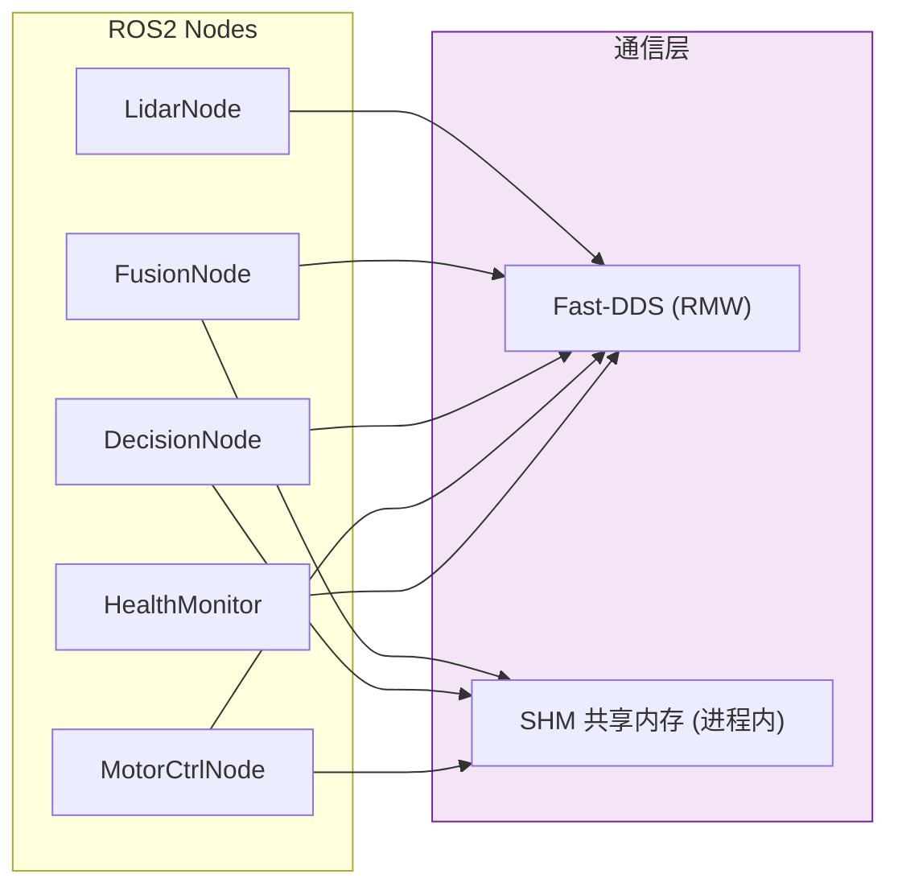

# 通信中间件

## 在总体架构中的位置



> 通信中间件基于 Fast-DDS，在 `compute_container` 内使用 SHM 传输消除序列化开销。

## 核心机制

### DDS 域划分

```
单 AMR 模式：
  DDS Domain 0 → 全部节点在同一域内通信

多 AMR 模式（ROS2 namespace）：
  DDS Domain 0, partition "amr1" → AMR-1 内部通信
  DDS Domain 0, partition "amr2" → AMR-2 内部通信
  FleetManager 监听所有 partition 的 /health/report
```

### QoS 分级

| 数据类型 | QoS Profile | 原因 |
|---------|------------|------|
| IMU (100Hz) | RELIABLE, depth=10 | 增量数据，丢失影响 KF 收敛 |
| PerceptionObjects | RELIABLE, depth=10 | 关键路径，不可丢失 |
| Camera (5Hz) | BEST_EFFORT, depth=10 | 绝对数据，单帧丢失可接受 |
| Heartbeat | RELIABLE, depth=10 | 监控数据，丢失会误触发恢复 |
| LiDAR (10Hz) | BEST_EFFORT, depth=10 | 高频增量，偶发丢帧不影响 DBSCAN |

### SHM 共享内存传输

- `compute_container` 内 Fusion/Decision/MotorCtrl 共享进程 → 数据通过 `shared_ptr` 直接传递，不走 DDS 序列化
- 跨进程 Metrics 通过 POSIX `shm_open("/amr_metrics_registry")` 共享——5 个进程读写同一块内存

## 依赖

| 依赖 | 版本 | 用途 |
|------|------|------|
| Fast-DDS (eProsima) | 2.14+ | RMW 实现 |
| `rclcpp` | Jazzy | ROS2 客户端库，封装 DDS 调用 |
| POSIX `shm_open` | — | 共享内存指标聚合 |

## 参考

- [DDS 定制指南](../guides/06-dds-customization.md) — Fast-DDS XML QoS profiles
- [ADR-8: QoS 选择](../adr/03-adr.md#adr-8-qos-选择--按-topic-差异化)
