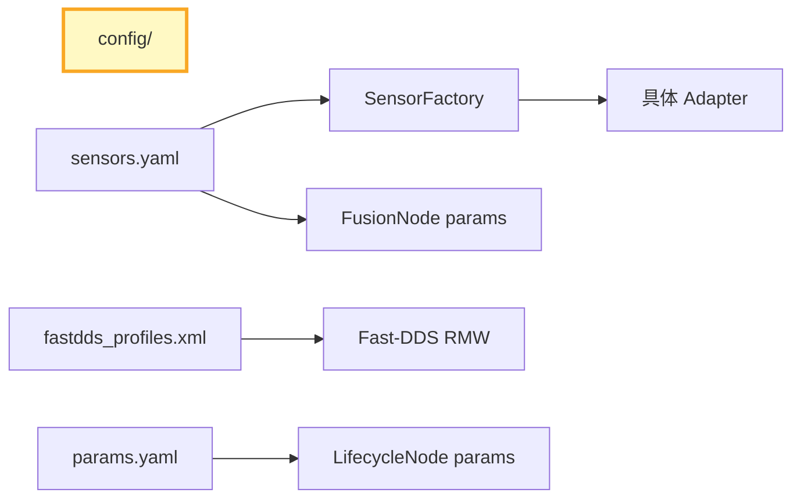

# 配置管理

## 一、位置



## 二、内部结构

```
config/
├── sensors.yaml             # 传感器选型 (type + topic)
├── fastdds_profiles.xml     # DDS QoS profile (XML)
├── params.yaml              # 运行时参数 (degradation timeout 等)
├── grafana_dashboard.json   # Prometheus 面板
└── sros2/                   # 安全密钥 (gitignored)
     ├── private/
     └── enclaves/
```

## 三、核心流程

```
加载顺序：
  system.launch.py
    ├── 1. clean_shm: rm /dev/shm/amr_metrics_registry
    ├── 2. sensors.yaml → ROS2 params → FusionNode::declare_parameter
    │       └── get_parameter → SensorFactory::create_*(cfg)
    ├── 3. fastdds_profiles.xml → 环境变量 FASTRTPS_DEFAULT_PROFILES_FILE
    ├── 4. params.yaml → ROS2 params → LifecycleNode 各节点
    └── 5. sros2/ → 环境变量 ROS_SECURITY_*

优先级：launch 文件参数 > YAML 文件 > declare_parameter 默认值
```

### sensors.yaml ↔ SensorFactory

| YAML type | SensorFactory 分支 | 创建的类 |
|-----------|------------------|---------|
| `simulated` | `create_lidar` → `SimulatedLidar` | `SimulatedLidar` |
| `sick_tim781` | `create_lidar` → `SickTiM781Adapter` | `SickTiM781Adapter(topic)` |
| `simulated` | `create_imu` → `SimulatedImu` | `SimulatedImu` |
| `simulated` | `create_camera` → `SimulatedCamera` | `SimulatedCamera` |
| *(unknown)* | 回退到 `Simulated*` | `SimulatedLidar/Imu/Camera` |

## 四、接口

| 文件 | 消费者 | 加载方式 |
|------|--------|---------|
| `sensors.yaml` | FusionNode → SensorFactory | ROS2 params (declare_parameter) |
| `fastdds_profiles.xml` | Fast-DDS RMW | 环境变量 |
| `params.yaml` | 各 LifecycleNode | ROS2 params |
| `grafana_dashboard.json` | Grafana (手动导入) | JSON import |
| `sros2/*` | SROS2 middleware | 环境变量 ROS_SECURITY_* |

## 五、边界与降级

| 故障 | 行为 |
|------|------|
| sensors.yaml 格式错误 | ROS2 params 使用默认值 (simulated)，RCLCPP_WARN |
| type 未知 | SensorFactory 回退到 SimulatedLidar，RCLCPP_WARN |
| fastdds_profiles.xml 缺失 | Fast-DDS 使用内置默认 QoS |
| sros2 密钥缺失 | DDS 通信降级为非加密模式 |

### 设计约束

- 传感器切换 **不支持运行时热插拔** —— 需要重启进程（硬件驱动启动需要握手）
- 敏感配置不入库 —— SROS2 keystore 在 `config/sros2/private/`，已 gitignore
- YAML 参数不做过早校验 —— `SensorFactory` 运行时报错，不回退编译期检查

## 六、参考

- [传感器管线](sensor-pipeline.md) — SensorFactory 创建流程
- [DDS 定制指南](../guides/06-dds-customization.md) — XML profile 详解
