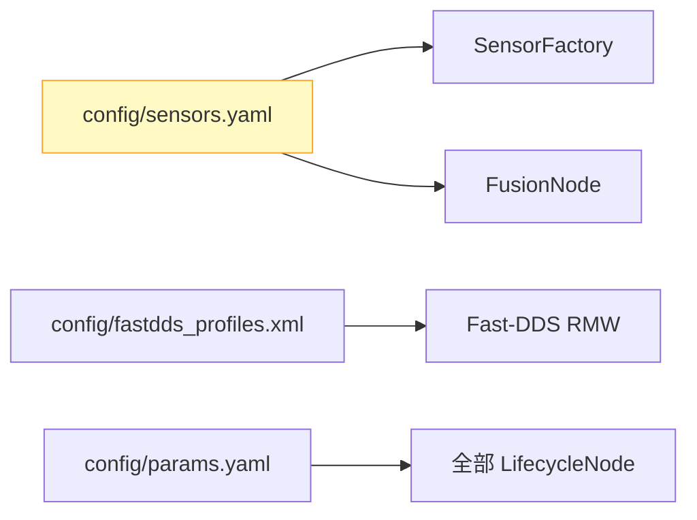

# 配置管理

## 在总体架构中的位置



> 配置层遵循"约定优于配置"原则——默认值覆盖 80% 场景，YAML 显式覆盖其余 20%。

## 配置文件

### sensors.yaml — 传感器选型

```yaml
sensors:
  lidar:
    type: simulated          # 或 sick_tim781
    topic: /scan
  imu:
    type: simulated
    topic: /imu/data
  camera:
    type: simulated
    topic: /camera/color/image_raw
```

加载方式：`FusionNode::declare_parameter("sensors.lidar.type", "simulated")` → `get_parameter` → `SensorFactory::create_lidar(cfg)`。

### fastdds_profiles.xml — DDS QoS

```xml
<profiles>
  <participant profile_name="amr_participant">
    <rtps><useBuiltinTransports>true</useBuiltinTransports></rtps>
  </participant>
  <data_writer profile_name="imu_writer">
    <qos><reliability><kind>RELIABLE</kind></reliability></qos>
  </data_writer>
</profiles>
```

加载方式：`FASTRTPS_DEFAULT_PROFILES_FILE` 环境变量，或 launch 文件 `<env>` 注入。

### params.yaml — 运行时参数

- `degradation.timeout_imu` / `timeout_lidar` / `timeout_camera`
- `motor.step_size` — 可通过 `/cmd/set_param` service 运行时修改

## 配置加载流程

```
system.launch.py
  ├── sensors.yaml → ROS2 parameters → FusionNode::declare_parameter
  ├── fastdds_profiles.xml → FASTRTPS_DEFAULT_PROFILES_FILE env → Fast-DDS RMW
  └── params.yaml → ROS2 parameters → 各 LifecycleNode::declare_parameter
```

## 设计原则

- **热插拔不支持**：传感器切换需要重启进程（`sick_scan2` 驱动启动需要硬件握手），不支持运行时动态切换
- **参数校验在运行时**：`SensorFactory` 对未知 `type` 回退到 `SimulatedLidar` 并 `RCLCPP_WARN`
- **敏感配置不入版本库**：SROS2 keystore 在 `config/sros2/private/`，已 gitignore
