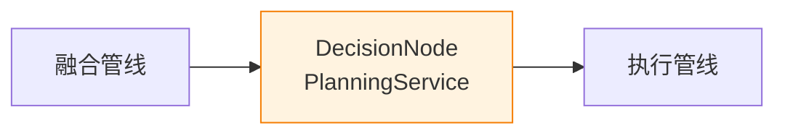
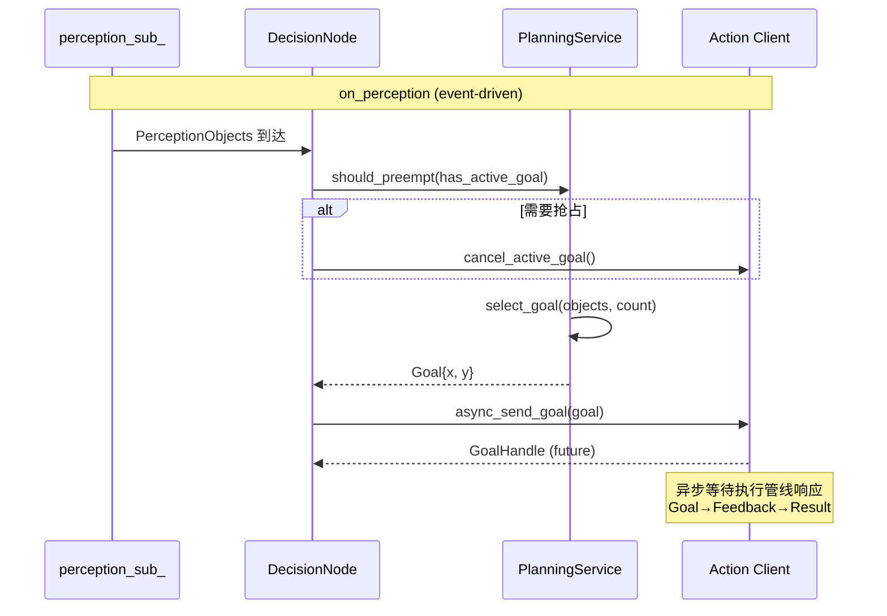

# 决策管线

## 在总体架构中的位置

> 决策管线是控制流的入口——接收感知结果，决定是否发送导航目标。

## 核心业务

### 抢占/重试策略

- **抢占**：新感知目标到达 + 上一个 goal 未完成 → `cancel_active_goal()` → 发送新 goal
- **重试**：goal 被拒绝 → 最多重试 `kMaxRetries` 次（`TargetSelector`）
- **取消**：执行管线接受 `CancelResponse::ACCEPT`，交由执行管线自己决定如何取消

## 依赖

| 依赖 | 说明 |
|------|------|
| `domain/planning/target_selector.hpp` | 感知目标 → Goal 映射 |
| `domain/planning/preempt_policy.hpp` | 抢占决策 |
| `PerceptionObjects` | 来自融合管线的 DDS 消息 |
| ROS2 Action Client | `MoveToPose` action |

## 被依赖

- [执行管线](actuation-pipeline.md) — 接收 `MoveToPose` goal

## 关键设计决策

- **Action 而非 Service**：导航是长时间运行的任务，需要 Goal→Feedback→Result + 取消能力。Service 是请求-响应，不适用
- **异步发送**：`async_send_goal` 返回 future，不阻塞回调线程
