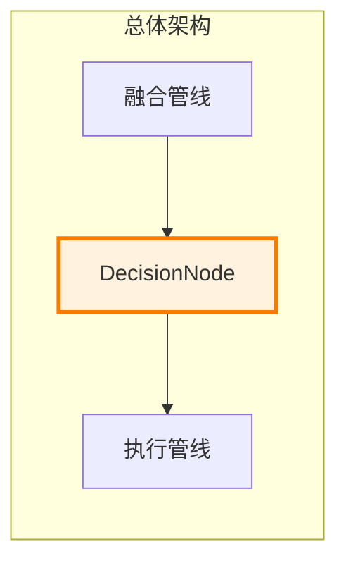
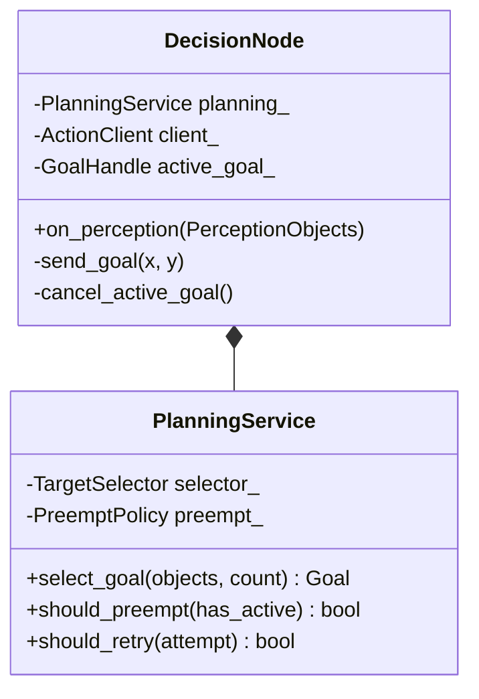
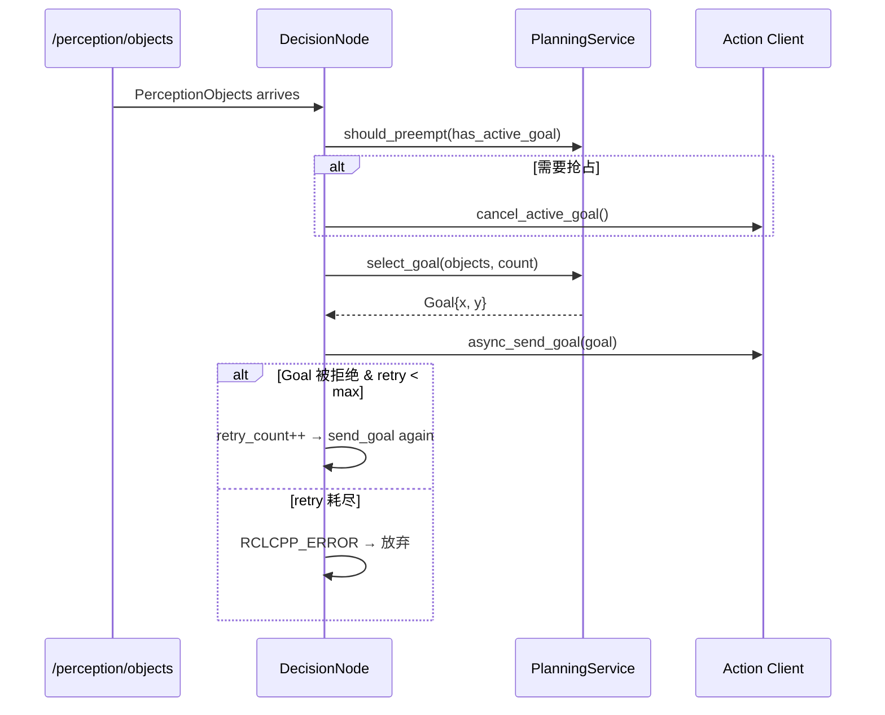

# 决策管线

## 一、位置

## 二、内部结构

| 组件 | 职责 |
|------|------|
| DecisionNode | ROS2 订阅 + Action Client + Lifecycle |
| PlanningService | 感知→Goal 映射 + 抢占决策 |
| TargetSelector | 目标选择（当前取 objects[0]） |
| PreemptPolicy | 新目标到达时是否取消旧 goal |

## 三、核心流程

### 抢占/重试参数

| 参数 | 默认值 | 说明 |
|------|:---:|------|
| `kMaxRetries` | 3 | Goal 被拒绝后最大重试次数 |
| `preempt` | 总是提前 | 新目标到达立即抢占旧目标 |

## 四、接口

| 接口 | 类型 | 方向 | 消费方/提供方 |
|------|------|:---:|------|
| `PerceptionObjects` | DDS sub | 入 | FusionNode |
| `MoveToPose` (Goal) | DDS Action | 出 | MotorCtrlNode |
| heartbeat | DDS pub | 出 | HealthMonitor |

## 五、边界与降级

| 故障 | 行为 | 恢复 |
|------|------|------|
| Action server 不可用 | `RCLCPP_WARN_THROTTLE`，跳过本次 goal | server 恢复后自动重试 |
| Goal 被拒绝 | 重试 `kMaxRetries` 次，每次间隔由 Action Client 重试逻辑决定 | 超过次数后放弃，等待下个感知结果 |
| 感知结果为空 | `on_perception` 不处理 | 下一帧有数据时恢复 |

### 性能

| 指标 | 目标 |
|------|:---:|
| `on_perception` 耗时 | <0.5ms |
| Goal 发送延迟 | <1ms (DDS SHM) |
| 内存分配 | 0（复用 active_goal_ SharedPtr） |

### 测试覆盖

| 测试 | 覆盖 |
|------|------|
| `test_decision` (1) | Perception→Goal 分发 + mock Action Server |

## 六、参考

- [MoveToPose.action](https://github.com/guang-lee-cn/ros2_amr_framework/blob/main/action/MoveToPose.action)
- [ADR-3: Action 而非 Service](../adr/03-adr.md#adr-3-电机控制接口--action-而非-service)
