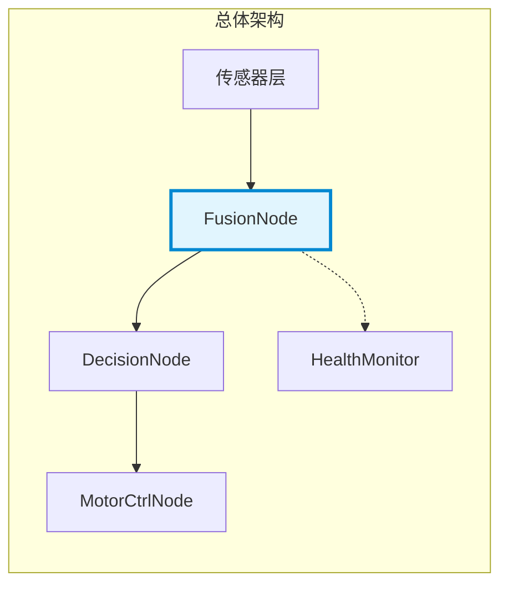
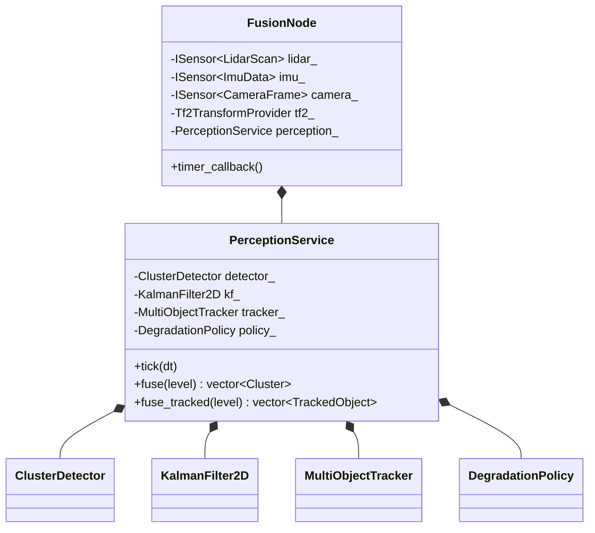
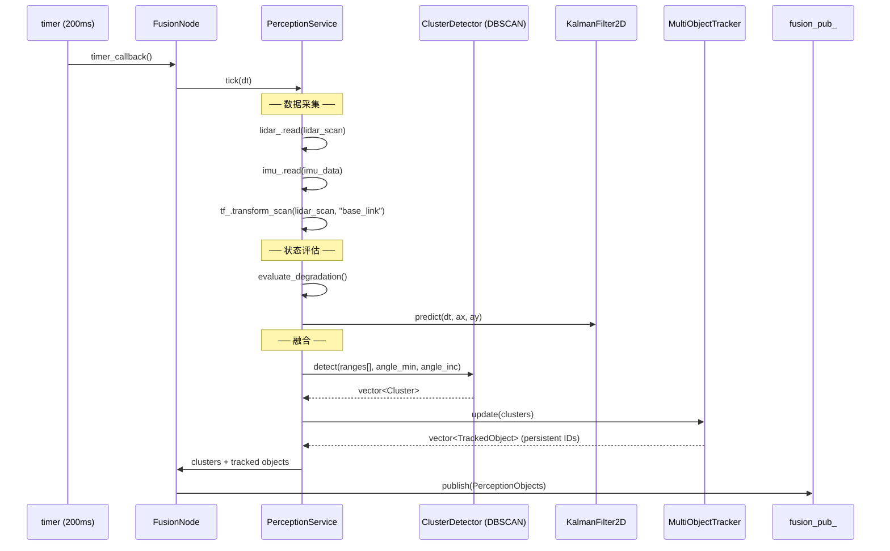

# 融合管线

## 一、位置



> 融合管线在 [总体架构](../ARCHITECTURE.md) 中的位置：传感器数据入口，PerceptionObjects 出口。运行在 compute_container 进程内。

## 二、内部结构



| 组件 | 层 | 职责 |
|------|:---:|------|
| FusionNode | infrastructure | ROS2 生命周期 + DDS pub/sub + 时钟驱动 |
| PerceptionService | application | 编排 sensor→cluster→track 流程 |
| ClusterDetector (DBSCAN) | domain | 密度聚类，输出 Cluster 列表 |
| KalmanFilter2D | domain | 4D 状态估计 (x,y,vx,vy) |
| MultiObjectTracker | domain | 最近邻关联 + 每 Track 独立 KF |
| DegradationPolicy | domain | 传感器超时评估 6 等级 |
| ITransformProvider | domain→infra | LiDAR→base_link 刚体变换 |

## 三、核心流程



### 参数配置

| 参数 | 默认值 | 说明 | 配置位置 |
|------|:---:|------|---------|
| `eps` | 0.3m | DBSCAN 邻域半径 | `ClusterDetector::Params` |
| `min_pts` | 5 | DBSCAN 最小点数（含核心点） | 同上 |
| `association_radius` | 0.5m | Tracker 匹配门限 | `TrackerParams` |
| `max_missed_frames` | 5 | 剪枝前连续丢失帧数 | 同上 |
| `max_tracks` | 20 | 最大活跃 track 数 | 同上 |
| `imu_timeout` | 0.5s | IMU 超时 → NO_IMU | `DegradationPolicy::Config` |
| `lidar_timeout` | 1.5s | LiDAR 超时 → NO_LIDAR | 同上 |
| `camera_timeout` | 3.0s | Camera 超时 → NO_CAMERA | 同上 |

### 降级决策流程

```
tick(dt) → 读传感器 → 计算 age → evaluate() → Level
                                          │
              ┌───────────────────────────┼──────────────────────────┐
              ▼                           ▼                          ▼
         missing==0                   missing==1               missing>=2
         FULL                        单传感器超时               CRITICAL
              │                           │                          │
         DBSCAN+KF+Tracker      部分降级（NO_*）           无融合输出
```

## 四、接口

### 输入

| 接口 | 类型 | 来源 | 频率 |
|------|------|------|:---:|
| `ISensor<LidarScan>::read()` | 函数调用 | 传感器适配器 | 5Hz |
| `ISensor<ImuData>::read()` | 函数调用 | 传感器适配器 | 5Hz |
| `ISensor<CameraFrame>::read()` | 函数调用 | 传感器适配器 | 5Hz |
| `ITransformProvider::transform_scan()` | 函数调用 | tf2 基础设施 | 5Hz |
| `config/sensors.yaml` | YAML 文件 | 启动加载 | 启动时 |
| ROS2 params | `declare_parameter` | launch 文件 | 启动时 |

### 输出

| 接口 | 类型 | 消费者 | 频率 |
|------|------|--------|:---:|
| `PerceptionObjects` (DDS) | `/perception/objects` | DecisionNode | ~5Hz |
| heartbeat (DDS) | `/sensor/fusion/heartbeat` | HealthMonitor | 1Hz |
| Metrics (SHM) | `shared_metrics()` | HealthMonitor (Prometheus) | 持续 |

## 五、边界与降级

### 错误处理

| 故障 | 行为 | 恢复 |
|------|------|------|
| LiDAR read() 返回 false | `lidar_age += dt` → 超时后进入 NO_LIDAR | 传感器恢复后自动回 FULL |
| IMU read() 返回 false | `imu_age += dt` → 超时后进入 NO_IMU | 同上 |
| TF 变换不可用 | 跳过变换，直接用原始坐标 | TF 恢复后自动启用 |
| DBSCAN 无簇 | 返回空 Clusters，Tracker 进入 predict-only 模式 | 下一帧有簇时恢复 |
| Tracker 满 (20 tracks) | 新检测被丢弃 | 旧 track 超时剪枝后恢复 |

### 性能预算

| 指标 | 目标 | 实测 (x86_64) |
|------|:---:|:---:|
| tick() 总耗时 | <5ms | ~2ms |
| DBSCAN (360 pts) | <1ms | ~0.1ms |
| KF predict+update | <0.1ms | ~0.01ms |
| Tracker update | <1ms | ~0.1ms |
| 热路径内存分配 | 0 | 0 |
| Process RSS | <150MB | ~120MB |

### 测试覆盖

| 测试 | 文件 | 覆盖内容 |
|------|------|---------|
| DBSCAN (6 cases) | `quality/src/test_dbscan.cpp` | 单簇、双簇、噪声、参数、空输入、上限 |
| KF/EKF (8 cases) | `quality/src/test_kalman_filter.cpp` | 线性收敛、运动跟踪、野值拒绝、Joseph、range-bearing、跨模型一致性 |
| Tracker (6 cases) | `quality/src/test_tracker.cpp` | 单目标、持久ID、超时剪枝、双目标、运动跟踪、重置 |
| Fusion集成 (3 cases) | `quality/src/test_fusion.cpp` | 检测、降级、多周期运行 |

## 六、参考

- [DBSCAN 聚类设计](#) — `domain/perception/cluster_detector.hpp`
- [KF/EKF 设计](#) — `domain/perception/kalman_filter.hpp`
- [Tracker 设计](#) — `domain/perception/tracker.hpp`
- [降级策略](#) — `domain/perception/degradation_policy.hpp`
- [ADR-6: EKF 选型](../adr/03-adr.md#adr-6-calman-filter--ekf-upgrade-with-pluggable-measurement-models)
- [ADR-9: KF 选型](../adr/03-adr.md#adr-9-状态估计库选型--自研-kf-vs-开源方案)
- [HAL 设计](../guides/09-hal-design.md)
