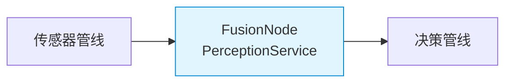

# 融合管线

## 在总体架构中的位置



> 融合管线是数据流的第一步处理——传感器数据进入，PerceptionObjects 输出。本模块还管理传感器降级状态。

## 核心业务

```mermaid
sequenceDiagram
    participant HAL as ISensor 接口
    participant PS as PerceptionService
    participant DBSCAN as ClusterDetector
    participant KF as KalmanFilter2D
    participant TRACKER as MultiObjectTracker
    participant DDS as fusion_pub_

    Note over HAL,DDS: timer_callback (200ms)

    HAL->>PS: lidar_.read(lidar_scan)
    HAL->>PS: imu_.read(imu_data)
    PS->>PS: tick(dt) — 计算传感器年龄
    PS->>PS: evaluate_degradation()

    PS->>KF: predict(dt, ax, ay)
    PS->>DBSCAN: detect(ranges[], angle_min, angle_inc)
    DBSCAN-->>PS: vector&lt;Cluster&gt;

    PS->>TRACKER: update(clusters)
    TRACKER-->>PS: vector&lt;TrackedObject&gt;

    PS->>PS: 填充 PerceptionObjects
    PS->>DDS: publish(msg)

    Note over PS: 降级时跳过聚类或直接输出空
```

### 数据处理链

```
LidarScan (8KB) ─┐
ImuData (12B)   ─┤ tick(dt) → DBSCAN → Tracker → PerceptionObjects
CameraFrame     ─┘   ↑          ↑        ↑
                     KF predict  密度聚类  最近邻关联
                     恒加速度     eps=0.3m  spawn/prune
```

### 降级策略

| 级别 | 条件 | 融合行为 | Tracker 行为 |
|------|------|---------|------------|
| FULL | 全部正常 | 完整管线 | 正常跟踪 |
| NO_IMU | IMU 缺失 | 加速度=0 | 正常 |
| NO_LIDAR | LiDAR 缺失 | 无聚类 → 空输入 | 仅 predict |
| NO_CAMERA | Camera 缺失 | 同 FULL | 正常 |
| CRITICAL | ≥2 缺失 | 无输出 | 暂停 |

> 状态变迁见 [总体架构](../ARCHITECTURE.md#三状态流传感器降级)。

## 依赖

| 依赖 | 说明 |
|------|------|
| `ISensor<LidarScan>` | 传感器接口（依赖注入） |
| `ISensor<ImuData>` | 同上 |
| `domain/perception/cluster_detector.hpp` | DBSCAN 聚类 |
| `domain/perception/kalman_filter.hpp` | EKF 状态估计 |
| `domain/perception/tracker.hpp` | 多目标跟踪 |
| `domain/perception/degradation_policy.hpp` | 降级策略 |

## 被依赖

- [决策管线](decision-pipeline.md) — 订阅 `/perception/objects`
- [健康监控](health-monitor.md) — 心跳

## 关键设计决策

- **DBSCAN 而非 scan-line**：笛卡尔空间聚类能分离角度连续但在空间中分开的物体。见 [ADR-9 选型](../adr/03-adr.md)
- **每 Track 独立 KF**：Tracker 为每个物体维护独立 KF，而非共享全局 KF。好处：物体交叉时不会互相污染
- **Joseph 形式协方差**：防止浮点累积误差导致 P 非对称正定
