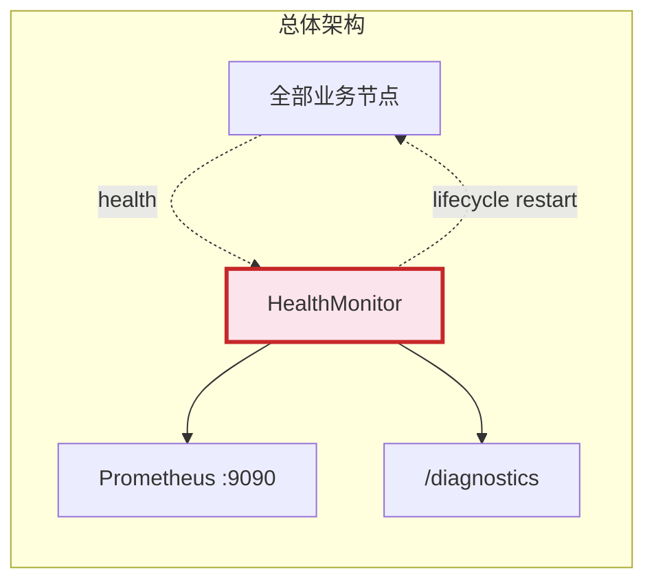
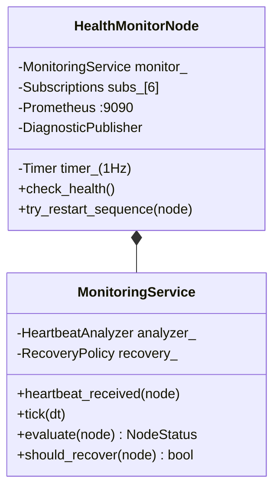
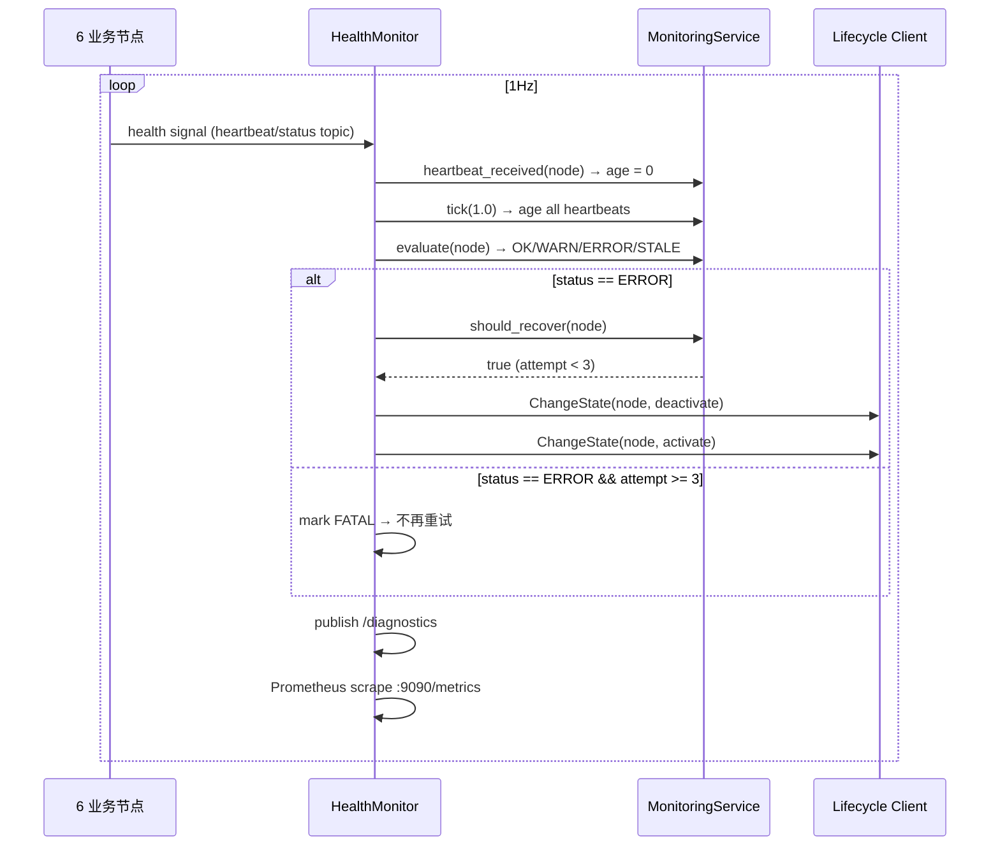

# 健康监控

## 一、位置

> 独立进程 (PID 5)，不能与被监控节点共享命运。

## 二、内部结构

| 组件 | 层 | 职责 |
|------|:---:|------|
| HealthMonitorNode | infrastructure | ROS2 订阅 6 节点 health + Prometheus + Lifecycle Client |
| MonitoringService | application | 心跳老化 + 状态评估 + 恢复决策 |
| HeartbeatAnalyzer | domain | 单节点状态判定 (OK/WARN/ERROR/STALE/FATAL) |
| RecoveryPolicy | domain | 重试计数 + 最大次数限制 (kMaxRetries=3) |

## 三、核心流程

### 状态判定表

| 条件 | 状态 | 行为 |
|------|:---:|------|
| `age < 80% × timeout` | OK | - |
| `80% × timeout < age < timeout` | WARN | 仅日志 |
| `age > timeout` | ERROR | 触发看门狗重启 |
| `age < 0` (从未收到) | STALE | 标记为未激活 |
| 重启超过 3 次 | FATAL | 放弃，系统 inactive |

### 监控节点配置

| 节点 | Health Topic | Timeout |
|------|-------------|:---:|
| lidar | `/sensor/lidar/heartbeat` | 1.5s |
| imu | `/sensor/imu/heartbeat` | 0.5s |
| camera | `/sensor/camera/heartbeat` | 3.0s |
| fusion | `/sensor/fusion/heartbeat` | 1.0s |
| decision | `/decision/heartbeat` | 2.0s |
| motor_ctrl | `/cmd/status` | 2.0s |

## 四、接口

| 接口 | 类型 | 方向 | 说明 |
|------|------|:---:|------|
| 6 heartbeat topics | DDS sub | 入 | 各节点定期发布 health |
| `/health/report` | DDS pub | 出 | HealthReport 汇总 |
| `/diagnostics` | DDS pub | 出 | ROS2 标准 DiagnosticArray |
| `:9090/metrics` | HTTP | 出 | Prometheus 指标 |
| Lifecycle ChangeState | Service Client | 出 | 看门狗重启 |

## 五、边界与降级

| 故障 | 行为 |
|------|------|
| 节点重启 3 次仍 ERROR | 标记 FATAL，停止重试 |
| HealthMonitor 自身崩溃 | launch `respawn=True, delay=2.0s` 自动重启。盲区 <2s。计算管线不受影响 |
| Prometheus socket 创建失败 | `RCLCPP_WARN`，指标不可用，业务不中断 |

> HealthMonitor 故障恢复方案详见 [ADR-12](../adr/03-adr.md#adr-12-healthmonitor-自身故障恢复--launch-respawn-vs-systemd-vs-互监控)。

### 性能

| 指标 | 目标 |
|------|:---:|
| `check_health()` 耗时 | <1ms (6 节点评估) |
| 看门狗重启延迟 | <2s |

### 测试覆盖

| 测试 | 覆盖 |
|------|------|
| `test_monitoring` (14) | HeartbeatAnalyzer (4), RecoveryPolicy (5), MonitoringService (5) |

## 六、参考

- [HeartbeatAnalyzer](https://github.com/guang-lee-cn/ros2_amr_framework/blob/main/include/ros2_robot_middleware/domain/monitoring/heartbeat_analyzer.hpp)
- [RecoveryPolicy](https://github.com/guang-lee-cn/ros2_amr_framework/blob/main/include/ros2_robot_middleware/domain/monitoring/recovery_policy.hpp)
- [ADR-4: Prometheus HTTP](../adr/03-adr.md#adr-4-健康监控暴露--prometheus-http-vs-ros2-topic)
