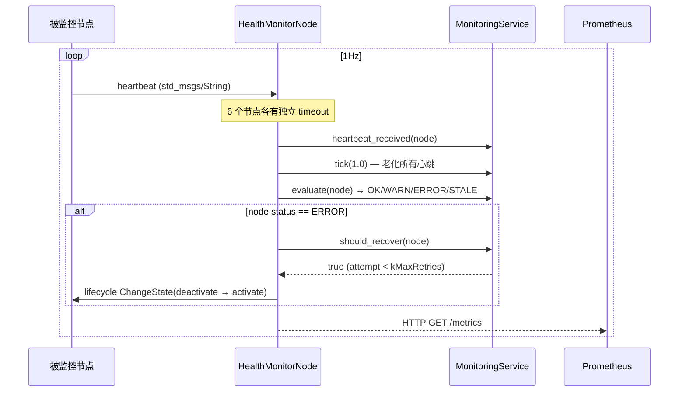

# 健康监控

## 在总体架构中的位置

> 健康监控是控制流的关键组件。独立进程——不能与被监控节点共享命运。

## 核心业务

### 状态判断

| 状态 | 条件 | 行为 |
|------|------|------|
| OK | `age < 80% × timeout` | 无 |
| WARN | `age > 80% × timeout` | 仅日志 |
| ERROR | `age > timeout` | 触发看门狗重启 |
| STALE | `age < 0`（从未收到） | 标记为未激活 |
| FATAL | 重启超过 `kMaxRetries=3` 次 | 放弃，标记 FATAL |

### Prometheus 端点

`:9090/metrics` — 暴露 7 类指标（传感器速率、四级延迟直方图、降级事件计数器等）。见 [可观测性](observability.md)。

## 依赖

| 依赖 | 说明 |
|------|------|
| `domain/monitoring/heartbeat_analyzer.hpp` | 心跳老化 + 状态评估 |
| `domain/monitoring/recovery_policy.hpp` | 重启策略 |
| `observability/metrics_registry.hpp` | Prometheus 指标数据源 |
| POSIX socket API | HTTP server（单线程 accept + recv/send） |

## 被依赖

- **全部业务节点**：发布 heartbeat 到各自 topic
- **FleetManager**：汇总 HealthReport

## 关键决策

- **独立进程**：如果 health_monitor 和 compute_container 同进程，compute 挂了 health 也挂——无法执行重启
- **Prometheus 不走 DDS**：DDS 挂了 metrics 也丢失 → 无法诊断"DDS 为什么挂了"。独立 HTTP 通道保障可观测性
