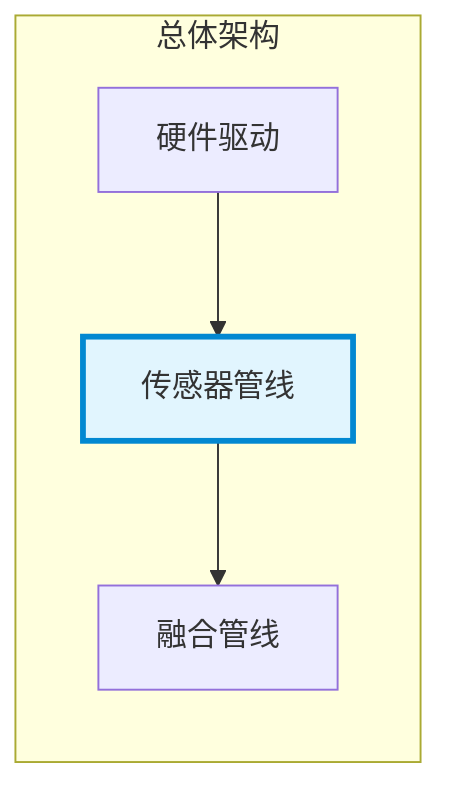
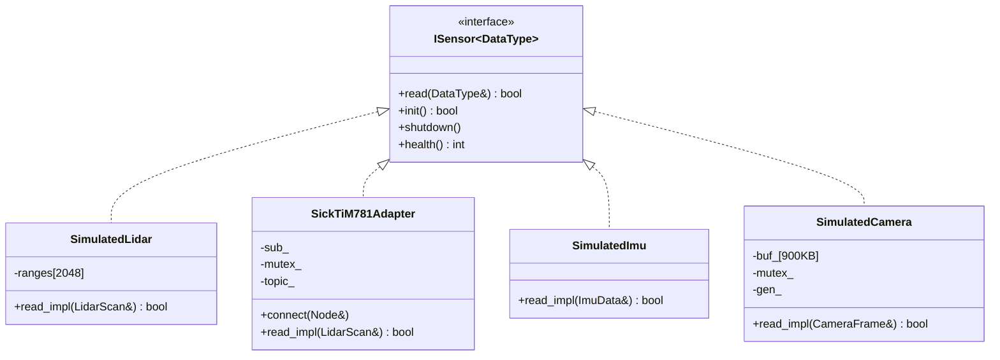
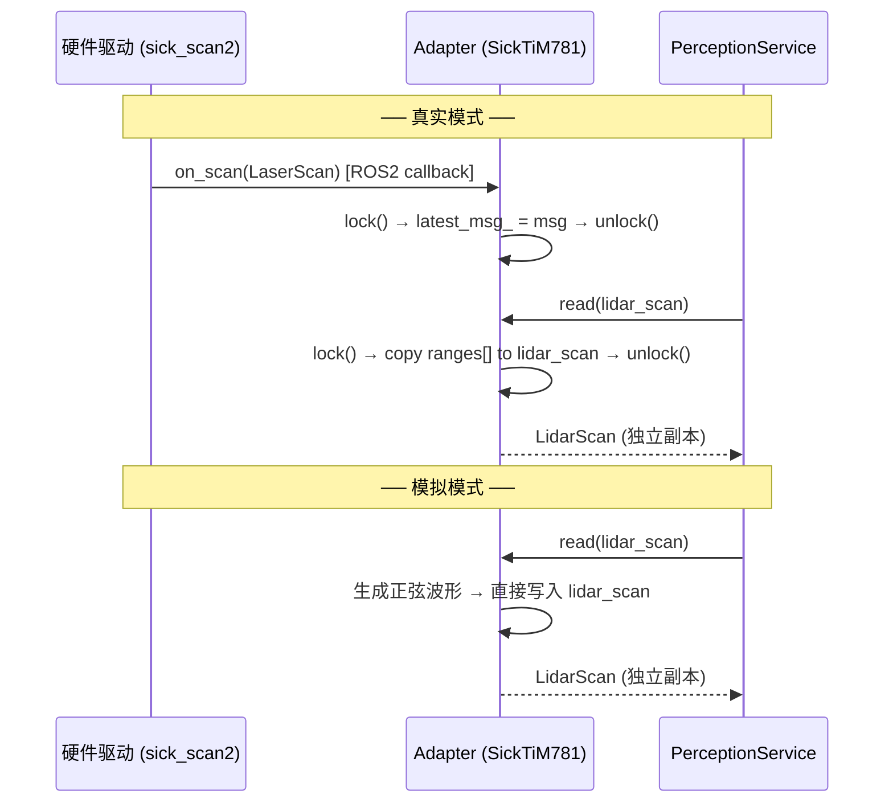

# 传感器管线

## 一、位置



## 二、内部结构



| 组件 | 类型 | 线程安全策略 | 数据量 |
|------|:---:|------|:---:|
| SimulatedLidar | 模拟 | 值拷贝（8KB 栈） | 10Hz |
| SimulatedImu | 模拟 | 值拷贝（12B 栈） | 100Hz |
| SimulatedCamera | 模拟 | 传感器持有 buffer + mutex | 5Hz, 900KB |
| SickTiM781Adapter | 真实 | 值拷贝 + mutex（ROS2 callback ↔ read） | 10Hz |

## 三、核心流程



### 模拟→真实切换

```yaml
# config/sensors.yaml
sensors:
  lidar:
    type: sick_tim781   # simulated → sick_tim781
    topic: /scan
```
不重新编译。`SensorFactory` 读取 `type` 创建对应 Adapter。

## 四、接口

| 接口 | 方向 | 类型 | 说明 |
|------|:---:|------|------|
| `ISensor<LidarScan>::read()` | 出 | 函数调用 | 读 LiDAR 数据 (8KB 值拷贝) |
| `ISensor<ImuData>::read()` | 出 | 函数调用 | 读 IMU 数据 (12B 值拷贝) |
| `ISensor<CameraFrame>::read()` | 出 | 函数调用 | 读 Camera 数据 (视图) |
| `sensor_msgs/LaserScan` | 入 | DDS | 真实 LiDAR 驱动输入 |
| `sensor_msgs/Imu` | 入 | DDS | 真实 IMU 驱动输入 |
| `sensor_msgs/Image` | 入 | DDS | 真实 Camera 驱动输入 |
| `config/sensors.yaml` | 入 | 文件 | 传感器选型 + Topic 配置 |

## 五、边界与降级

| 故障 | 行为 | 恢复 |
|------|------|------|
| 真实传感器断连 | Adapter 的 `latest_msg_` 保持为空，`read()` 返回 false | Fusion 的降级策略处理 |
| SimulatedLidar 内部错误 | `read()` 返回 false | 同上 |
| Camera buffer 不足 | `health_ = 2`，`read()` 返回 false | 调用方检查 `health()` |

### 性能

| 操作 | 耗时 |
|------|:---:|
| `ISensor<LidarScan>::read()` | ~1μs (memcpy 8KB) |
| `ISensor<ImuData>::read()` | ~10ns (12B) |
| `ISensor<CameraFrame>::read()` | ~1μs (mutex + 指针赋值) |

### 测试覆盖

| 测试 | 覆盖 |
|------|------|
| `test_sensor_nodes` (3) | Lidar/IMU/Camera Node 数据验证（ROS2 集成） |
| `test_sensor_hal` (5) | SimulatedLidar/Imu/Camera read/health/init |
| `test_sensor_hal` (1) | SickTiM781Adapter subscribe+read |

---

## 六、参考

- [HAL 设计文档](../guides/09-hal-design.md)
- [ADR-11: 传感器注入模式](../adr/03-adr.md#adr-11-传感器注入模式--isensor-接口-vs-模板参数-vs-注册表)
- [SensorFactory](https://github.com/guang-lee-cn/ros2_amr_framework/blob/main/include/ros2_robot_middleware/infrastructure/sensors/sensor_factory.hpp)
