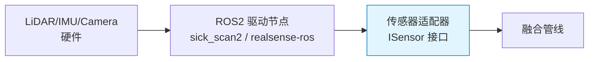
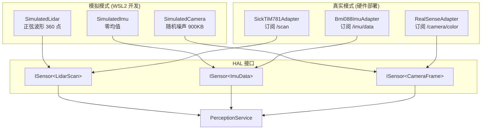

# 传感器管线

## 在总体架构中的位置



> 传感器管线是数据流的起点。本模块只负责**把硬件数据转换成域层可读的格式**，不做任何业务处理。

## 核心业务

将 ROS2 标准消息（`sensor_msgs`）适配到域层 `ISensor<DataType>` 接口，使融合管线无需感知传感器的具体型号。



### 切换方式

编辑 `config/sensors.yaml`，不重新编译：

```yaml
sensors:
  lidar:
    type: sick_tim781   # ← 从 simulated 改为此
    topic: /scan
```

`SensorFactory` 在 `on_configure()` 时读取参数，创建对应的适配器实例。

### 线程安全策略

| 数据类型 | 大小 | 策略 |
|---------|:---:|------|
| LidarScan | 8KB | 值拷贝 → 栈数组 |
| ImuData | 12B | 值拷贝 → 栈结构 |
| CameraFrame | 900KB | 适配器持有 buffer，`read()` 返回视图 + mutex 保护 |

## 依赖

| 依赖 | 说明 |
|------|------|
| `domain/sensor_interface.hpp` | ISensor 接口 + 数据类型定义 |
| `sensor_msgs` (仅真实适配器) | ROS2 标准消息 |
| `config/sensors.yaml` | 运行时传感器选型 |

## 被依赖

| 模块 | 如何依赖 |
|------|---------|
| [融合管线](fusion-pipeline.md) | 通过 `ISensor<DataType>&` 注入，`tick()` 中调 `read()` |

## 参考

- [HAL 设计文档](../guides/09-hal-design.md) — 接口演化、移植指南、行业方案
- [ADR-11 传感器注入模式](../adr/03-adr.md#adr-11-传感器注入模式--isensor-接口-vs-模板参数-vs-注册表)
