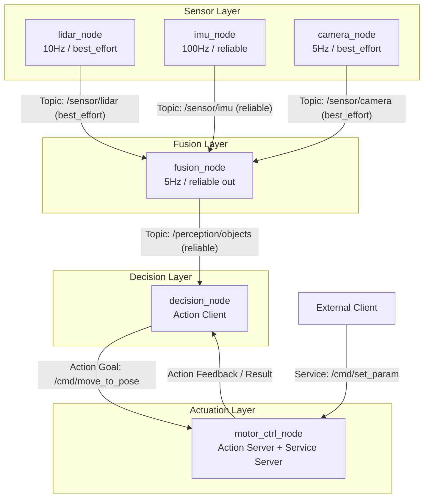
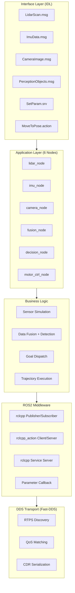

# Design Doc — ros2_robot_middleware

## 1. 节点拓扑与通信模式



**通信模式选型理由：**

| 链路 | 模式 | 理由 |
|------|------|------|
| Sensor → Fusion | Topic (单向) | 传感器是纯数据生产者，不关心消费方。单向流，Publisher/Subscriber 解耦 |
| Fusion → Decision | Topic (单向) | 感知结果是持续数据流（5Hz），Action 的 Goal-Feedback-Result 三阶段握手对持续流太重 |
| Decision → Motor | Action (双向) | 移动到目标点是长耗时操作（秒级），需要实时反馈进度、支持取消、确认到达 |
| External → Motor | Service (请求-响应) | 设一个参数是一次性的、毫秒级完成，不需要状态跟踪 |

## 2. 分层架构



**各层职责与接口约束：**

| 层 | 职责 | 允许依赖 | 禁止依赖 |
|----|------|---------|---------|
| Interface | 定义数据类型与通信契约 | std_msgs/Header | 不依赖任何节点实现 |
| Application | 节点生命周期、通信通道创建 | Interface 层的生成代码 | 节点间不直接 include 对方的类 |
| Business Logic | 传感器模拟算法、融合逻辑、运动控制 | Application 层传入的数据对象 | 不直接调用 rclcpp API（通过 Application 层封装的回调） |
| ROS2 Middleware | 提供发布/订阅/动作/服务 API | rclcpp, rclcpp_action | 不包含业务逻辑 |
| DDS Transport | RTPS 协议发现、QoS 匹配、序列化 | Fast-DDS, OMG DDS 规范 | 不感知 ROS2 节点概念 |

## 3. 技术选型

| 选项 | 实际选型 | 替代方案 | 选型理由 |
|------|---------|---------|----------|
| **构建系统** | colcon + ament_cmake | CMake 原生、Bazel | colcon 是 ROS2 官方标准；ament_cmake 提供 rosidl 代码生成；Bazel 多语言支持更好但 ROS2 生态支持不成熟 |
| **RMW 实现** | Fast-DDS (eProsima) | Cyclone DDS、RTI Connext | ROS2 Jazzy 默认；Apache-2.0 许可证无商用限制；XML Profile 可定制底层行为（R0 核心需求） |
| **C++ 标准** | C++17 | C++20 | Ubuntu 24.04 默认工具链完整支持；rclcpp API 使用 C++17（非 C++20）；稳定性和兼容性优先 |
| **通信范式** | Topic + Service + Action | 纯 Topic | 不同场景匹配不同范式：持续流用 Topic（传感器），短调用用 Service（参数），长操作用 Action（运动） |
| **测试框架** | gtest + 独立 CMake 工程 | ament_cmake_gtest | 独立工程零生产代码侵入；通过 Publisher/Service Client 驱动测试（集成测试优先级高于单元测试） |
| **日志** | RCLCPP_*_THROTTLE | spdlog、glog | ROS2 内置，无需额外依赖；限流宏防止高频日志风暴 |

## 4. DDS 定制计划 (R0)

### 4.1 Fast-DDS XML Profile 自定义配置

```xml
<!-- 示例：自定义 Discovery 和 Socket Buffer -->
<profiles>
    <participant profile_name="robot_participant">
        <rtps>
            <builtin>
                <initialAnnouncements>
                    <count>5</count>      <!-- 启动时多发几次 Announcement，加速发现 -->
                </initialAnnouncements>
            </builtin>
        </rtps>
    </participant>
    <data_writer profile_name="imu_writer">
        <qos>
            <reliability>
                <kind>RELIABLE</kind>
            </reliability>
        </qos>
        <historyMemoryPolicy>PREALLOCATED</historyMemoryPolicy>
    </data_writer>
    <data_reader profile_name="lidar_reader">
        <qos>
            <reliability>
                <kind>BEST_EFFORT</kind>
            </reliability>
        </qos>
    </data_reader>
</profiles>
```

**计划修改的 DDS 参数：**

| 参数 | 默认值 | 自定义值 | 目的 |
|------|--------|---------|------|
| `initialAnnouncements.count` | 3 | 5 | 加速节点启动时的 RTPS 发现，减少冷启动丢消息 |
| `historyMemoryPolicy` | DYNAMIC | PREALLOCATED (IMU writer) | 预分配内存，避免动态扩容引入的延迟抖动，适合高频 reliable 通道 |
| `socketBufferSize` | 默认 | 待量化测试后确定 | 防止 best_effort 通道在高负载下丢帧 |

### 4.2 QoS 量化对比实验

**实验设计：**

| 变量 | 对照组 (best_effort) | 实验组 (reliable) |
|------|---------------------|-------------------|
| 发布频率 | 10Hz / 100Hz / 200Hz | 同左 |
| 网络条件 | 本地 localhost | 同左 |
| 丢包统计 | 订阅端计数 missing seq | 同左 |
| 延迟测量 | 消息时间戳 vs 订阅收到时间 | 同左 |

**测试用例输出格式（预期）：**

```
[QoS Benchmark] sensor=lidar qos=best_effort rate=200Hz
  sent=2000, received=1987, loss=0.65%, avg_latency=0.8ms, p99_latency=2.1ms

[QoS Benchmark] sensor=lidar qos=reliable rate=200Hz
  sent=2000, received=2000, loss=0.00%, avg_latency=1.5ms, p99_latency=4.3ms
```

**面试时的一句话解释：**

> "best_effort 延迟低（0.8ms）但丢 0.65%；reliable 零丢包但延迟翻倍（1.5ms）。选择哪个取决于传感器：IMU 不能丢所以用 reliable，LiDAR 可以忍受偶尔丢帧所以用 best_effort。这个 trade-off 不是在 rclcpp 层背下来的，是我实际测出来的。"
